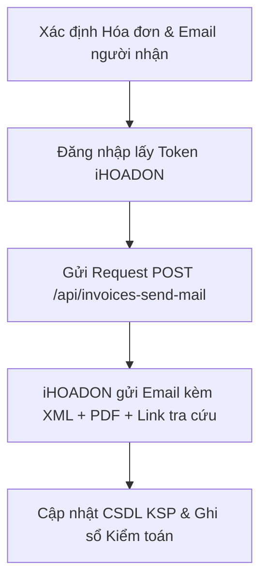

# 📧 iHOADON Send Invoice Email (Gửi Email Hóa Đơn Điện Tử Bán Ra)

Skill này cung cấp quy trình tự động hóa 100% việc gửi email hóa đơn điện tử bán ra đã xuất (trạng thái `DA_XUAT` hoặc đã cấp mã CQT) trực tiếp từ hệ thống **EFY-iHOADON** (`ihoadon.com.vn`) đến khách hàng và các email theo dõi nội bộ.

---

## 🌐 Cổng dịch vụ & Cấu hình iHOADON
* **URL dịch vụ**: `https://ihoadon.com.vn` (qua `settings.ihoadon_base_url`)
* **Mã số thuế**: `4401053694` (CÔNG TY CỔ PHẦN ĐẦU TƯ VÀ PHÁT TRIỂN CÔNG NGHỆ INUT)
* **API gửi mail**: `POST /api/invoices-send-mail`
* **Xác thực**:
  * `Authorization: Bearer <jwt_access_token>`
  * `TaxCode: 4401053694`
  * `Accept: application/json`

---

## ⚙️ Quy trình xử lý tự động (5 Bước chuẩn hóa)



### 1. Xác định Hóa đơn cần gửi
* Có thể truyền **ID nội bộ iHOADON (UUID)**, ví dụ `E66778CF-D149-405D-92A7-987AEDBBD000`.
* Hoặc tìm theo **Số hóa đơn** (ví dụ `43`) và **Ký hiệu hóa đơn** (ví dụ `C26TPK`).
* Hoặc tìm hóa đơn mới nhất theo **Mã số thuế / Tên khách hàng** trong CSDL KSP.

### 2. Chuẩn hóa danh sách Email
* Phân tách nhiều email bằng dấu chấm phẩy (`;`) không có khoảng trắng thừa:
  * Ví dụ: `hdcamera150@gmail.com;ngohuynhngockhanh@gmail.com`
* Lọc bỏ các email trùng lặp hoặc không hợp lệ.

### 3. Gọi API iHOADON
* Gửi payload JSON tới `POST https://ihoadon.com.vn/api/invoices-send-mail`:
  ```json
  {
    "invoices": [
      {
        "id": "E66778CF-D149-405D-92A7-987AEDBBD000",
        "email": "hdcamera150@gmail.com;ngohuynhngockhanh@gmail.com"
      }
    ]
  }
  ```
* Phản hồi thành công từ iHOADON:
  ```json
  {
    "status": "success",
    "code": "IWS001",
    "data": {}
  }
  ```

### 4. Nội dung Email khách hàng nhận được
* **Tiêu đề**: `[iHOADON] Thông báo phát hành hóa đơn điện tử - CÔNG TY CỔ PHẦN ĐẦU TƯ VÀ PHÁT TRIỂN CÔNG NGHỆ INUT`
* **File đính kèm**:
  * Tệp `.xml` gốc có chữ ký số hợp lệ của iNut.
  * Tệp `.pdf` bản thể hiện hóa đơn đầy đủ mã CQT.
* **Link tra cứu trực tuyến**: Tra cứu hóa đơn bằng mã tra cứu hoặc số hóa đơn tại `https://ihoadon.vn`.

### 5. Cập nhật CSDL KSP & Khách hàng
* Lưu email người nhận vào trường `buyer_email` của bảng `ihoadon_invoices`.
* Cập nhật email vào hồ sơ `customers` tương ứng trong CSDL KSP.
* Ghi nhật ký kiểm toán `audit_logs` với thao tác `ihoadon_send_email`.

---

## 🚀 Cách sử dụng từ Python SDK / Codebase

```python
from app.config import get_settings
from app.ihoadon import Client

settings = get_settings()

with Client(settings) as client:
    invoice_id = "E66778CF-D149-405D-92A7-987AEDBBD000"
    emails = "hdcamera150@gmail.com;ngohuynhngockhanh@gmail.com"
    
    # Gửi email trực tiếp qua iHOADON API
    result = client.send_invoice_email(invoice_id, emails)
    print("Kết quả gửi email:", result)
```

---

## 📡 REST API Endpoint trên KSP Backend

* **URL**: `POST /api/inv/ihoadon/invoices/{invoice_id}/send-email`
* **Quyền hạn**: Quản trị viên (`require_admin`)
* **Request Body**:
  ```json
  {
    "emails": "hdcamera150@gmail.com, ngohuynhngockhanh@gmail.com"
  }
  ```
* **Response**:
  ```json
  {
    "ok": true,
    "invoice_id": "E66778CF-D149-405D-92A7-987AEDBBD000",
    "emails": "hdcamera150@gmail.com;ngohuynhngockhanh@gmail.com",
    "message": "Đã gửi email hóa đơn thành công"
  }
  ```
