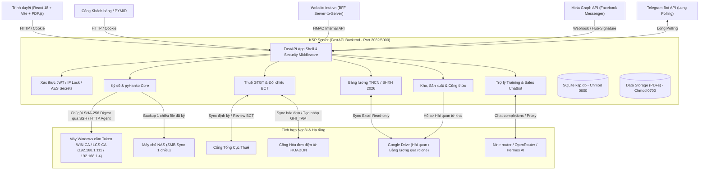
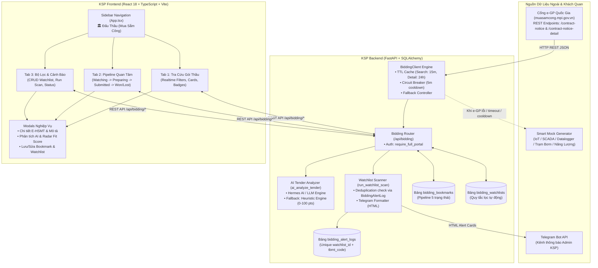
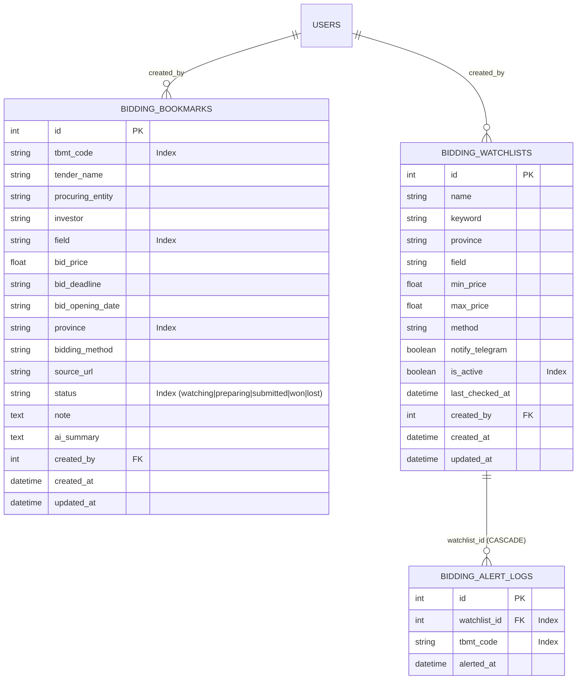

# KSP Operations Suite & PDF Signer — Cẩm Nang Tri Thức & Quy Trình Phát Triển (`gemini.md`)

> **Đơn vị chủ quản:** CÔNG TY CỔ PHẦN ĐẦU TƯ VÀ PHÁT TRIỂN CÔNG NGHỆ INUT  
> **Mã số thuế:** `4401053694`  
> **Phiên bản hệ thống:** 2.0.0 (FastAPI + React 18 + pyHanko)  
> **Mục tiêu:** Hệ thống tự host toàn diện phục vụ Ký số PDF từ xa chuẩn pháp lý Việt Nam, Quản lý Thuế GTGT & Hóa đơn iHOADON / Tổng Cục Thuế, Quản lý Kho - Sản xuất - Công nợ - Bán hàng, Bảng lương & Thuế TNCN/BHXH 2026, Hồ sơ Hải quan ECUS & Google Drive, Trợ lý AI iNut Training / Facebook Messenger / Telegram Bot, và Cổng hợp tác PYMID CO.OP.

---

## 1. TỔNG QUAN HỆ THỐNG & KIẾN TRÚC CỐT LÕI

### 1.1. Sơ đồ kiến trúc tổng thể



### 1.2. Cơ chế Ký số Văn bản PDF (Remote Signing)
- **Nguyên lý cốt lõi:** **Chỉ SHA-256 digest (hash) được truyền qua mạng** tới máy Windows cắm USB Token. File PDF gốc **không bao giờ** rời khỏi máy chủ.
- **Thông tin USB Token doanh nghiệp:**
  - Nhà cung cấp: **WIN-CA** (Chủ thể: `CÔNG TY CỔ PHẦN ĐẦU TƯ VÀ PHÁT TRIỂN CÔNG NGHỆ INUT`, MST: `4401053694`, hiệu lực đến 15/06/2027).
  - **Mã PIN mặc định**: `12345678` (tự động nạp qua `CspParameters.KeyPassword` dạng `SecureString`, cờ `NoPrompt`, không bao giờ bật popup hỏi PIN tương tác).
  - **Máy Windows cắm Token**: Tên máy `DESKTOP-2022PHR` (mặc định IP `192.168.1.10`, xác thực bằng SSH key `id_ed25519`).
- **Cơ chế dò tìm IP động qua Nmap (`host_discovery.py`):**
  - Khi máy Windows đổi IP DHCP, hệ thống tự động chạy `nmap -sT -p 445 --script smb-os-discovery 192.168.1.0/24` để tìm đúng máy có `Computer name: DESKTOP-2022PHR` và tự động cập nhật IP mới vào runtime (kèm bộ đệm 1 giờ).
  - CLI hỗ trợ kiểm tra và cập nhật cấu hình: `python3 scripts/discover_windows_host.py --force --update-env`.
- **2 Chế độ kết nối Token (`SIGNING_MODE`):**
  1. **`ssh` (Mặc định & Khuyến nghị):** Backend SSH trực tiếp vào máy Windows qua tài khoản Administrator, điều khiển PowerShell truy xuất kho chứng thư `Cert:\CurrentUser\My` và CSP. Không cần cài bất kỳ phần mềm agent nào trên Windows ngoài OpenSSH Server. PIN token được nạp tự động qua backend. Đã kiểm chứng thực tế với USB Token **WINCA / LCS-CA**.
  2. **`agent`:** Backend gọi HTTP/HTTPS tới một agent Python nhỏ chạy dịch vụ nền (NSSM) trên máy Windows (`windows-agent/agent.py`), tương tác qua **PKCS#11 DLL**.
- **Tiêu chuẩn Ký & Định dạng:**
  - Chuẩn chữ ký số PDF: **PAdES**, hỗ trợ **LTV (Long Term Validation)** và **TSA (RFC 3161 Timestamp)**.
  - Hình thức chữ ký (Appearance): Render bằng **Pillow** (supersampling 4x, font TrueType `DejaVuSans`, logo INUT chìm, thông tin người ký, MST, lý do, địa điểm, căn lề chuẩn tiếng Việt) rồi nhúng dạng ảnh để tránh lỗi giãn chữ của pyHanko.
  - Tọa độ ký: Frontend tính toán chuyển đổi điểm canvas sang PDF point thông qua `viewport.convertToPdfPoint` (tự xử lý lật trục Y và zoom).
### 1.3. Mô hình An ninh & Bảo mật
- **Xác thực:** JWT lưu trong `HttpOnly`, `SameSite=Lax` Cookie.
- **Chống Brute-force:** Nhập sai mật khẩu liên tiếp $\ge 5$ lần trong vòng 30 phút $\rightarrow$ Khóa IP tạm thời 30 phút (ghi vết qua bảng `AuditLog`).
- **Bảo vệ Middleware:** Chặn CSRF theo Origin header, thêm security headers (`X-Content-Type-Options: nosniff`, `X-Frame-Options: SAMEORIGIN`, `Content-Security-Policy`, `Referrer-Policy`).
- **Mã hóa Dữ liệu:** Bí mật cấu hình (mật khẩu iHOADON, SMB, API keys, số điện thoại lead công khai) được mã hóa bằng **AES-GCM / Fernet** trước khi lưu vào SQLite.
- **Quyền tập tin:** Database `ksp.db` phân quyền `0600`, thư mục lưu trữ `DATA_DIR` phân quyền `0700`.

---

## 2. BẢN ĐỒ MÃ NGUỒN (CODEBASE MAP)

### 2.1. Backend (`backend/app/`)
| Tệp nguồn | Vai trò & Trách nhiệm nghiệp vụ |
|---|---|
| [`main.py`](file:///home/ksp/ksp-pdfsign/backend/app/main.py) | Entrypoint FastAPI, middleware bảo mật, lifecycle startup/shutdown, router aggregation. |
| [`config.py`](file:///home/ksp/ksp-pdfsign/backend/app/config.py) | Đọc cấu hình từ `.env` qua Pydantic Settings, quản lý effective secrets và overrides từ DB. |
| [`db.py`](file:///home/ksp/ksp-pdfsign/backend/app/db.py) | Định nghĩa toàn bộ schema SQLAlchemy ORM cho 30+ bảng dữ liệu. |
| [`auth.py`](file:///home/ksp/ksp-pdfsign/backend/app/auth.py) | Xác thực JWT, seed admin, các dependency kiểm tra quyền (`require_admin`, `require_user`, `require_full_portal`, `require_training`). |
| [`security.py`](file:///home/ksp/ksp-pdfsign/backend/app/security.py) & [`crypto.py`](file:///home/ksp/ksp-pdfsign/backend/app/crypto.py) | Băm mật khẩu, mã hóa/giải mã bí mật bằng AES-GCM. |
| [`signing.py`](file:///home/ksp/ksp-pdfsign/backend/app/signing.py) | Xử lý quy trình ký số pyHanko, cấu hình `ExternalTokenSigner` và appearance. |
| [`token_backend.py`](file:///home/ksp/ksp-pdfsign/backend/app/token_backend.py) | Điều phối trung gian giữa chế độ `ssh` ([`win_ssh.py`](file:///home/ksp/ksp-pdfsign/backend/app/win_ssh.py)) và `agent` ([`agent_client.py`](file:///home/ksp/ksp-pdfsign/backend/app/agent_client.py)). |
| [`host_discovery.py`](file:///home/ksp/ksp-pdfsign/backend/app/host_discovery.py) | Tự động quét Nmap dải mạng `192.168.1.0/24` tìm IP động của máy Windows `DESKTOP-2022PHR` khi DHCP thay đổi. |
| [`appearance.py`](file:///home/ksp/ksp-pdfsign/backend/app/appearance.py) | Vẽ giao diện con dấu / chữ ký số dạng ảnh bitmap qua Pillow. |
| [`verify.py`](file:///home/ksp/ksp-pdfsign/backend/app/verify.py) | Kiểm tra chữ ký: toàn vẹn, hợp lệ mật mã, chuỗi CA tin cậy (Root CA quốc gia VNRCA), OCSP/CRL, LTV. |
| [`tax_ops.py`](file:///home/ksp/ksp-pdfsign/backend/app/tax_ops.py), [`tax_review.py`](file:///home/ksp/ksp-pdfsign/backend/app/tax_review.py), [`tax_policy.py`](file:///home/ksp/ksp-pdfsign/backend/app/tax_policy.py) | Nghiệp vụ thuế GTGT 01/GTGT, parse Excel báo cáo thuế, phát hiện lỗi âm `[40]`, tách nhóm thuế suất 8%/10%/KCT. |
| [`tax_defense.py`](file:///home/ksp/ksp-pdfsign/backend/app/tax_defense.py) & [`tax_defense_api.py`](file:///home/ksp/ksp-pdfsign/backend/app/tax_defense_api.py) | Phân hệ Giải trình Thuế & Thẩm tra Doanh thu 2022-2025, ma trận 4 năm, phân bổ Tiers & Thuế suất, cơ cấu chi phí KHÔNG PHỤ THUỘC TỒN KHO, xuất Excel & nạp bảng kê mua vào. |
| [`payroll.py`](file:///home/ksp/ksp-pdfsign/backend/app/payroll.py) & [`payroll_api.py`](file:///home/ksp/ksp-pdfsign/backend/app/payroll_api.py) | Công cụ tính lương theo Luật Thuế TNCN 109/2025/QH15 & BHXH 2026, tính thực lĩnh mục tiêu `plan_net_target`. |
| [`inventory.py`](file:///home/ksp/ksp-pdfsign/backend/app/inventory.py), [`inv_api.py`](file:///home/ksp/ksp-pdfsign/backend/app/inv_api.py), [`inv_import.py`](file:///home/ksp/ksp-pdfsign/backend/app/inv_import.py), [`inv_export.py`](file:///home/ksp/ksp-pdfsign/backend/app/inv_export.py) | Quản lý kho, nhập hàng, bán hàng, xuất kho, sản xuất, công thức định mức (BOM), cảnh báo âm kho. |
| [`ihoadon.py`](file:///home/ksp/ksp-pdfsign/backend/app/ihoadon.py), [`ihoadon_sync.py`](file:///home/ksp/ksp-pdfsign/backend/app/ihoadon_sync.py), [`ihoadon_delivery.py`](file:///home/ksp/ksp-pdfsign/backend/app/ihoadon_delivery.py) | Tích hợp iHOADON: tải hóa đơn `DA_XUAT`, tạo hóa đơn nháp `GHI_TAM` tự động chuyển tiền bằng chữ. |
| [`bbbg.py`](file:///home/ksp/ksp-pdfsign/backend/app/bbbg.py), [`invoice.py`](file:///home/ksp/ksp-pdfsign/backend/app/invoice.py), [`money.py`](file:///home/ksp/ksp-pdfsign/backend/app/money.py) | Sinh Biên Bản Bàn Giao, Báo Giá, Đề Nghị Thanh Toán qua WeasyPrint + Jinja2, đọc số tiền thành chữ tiếng Việt. |
| [`customs.py`](file:///home/ksp/ksp-pdfsign/backend/app/customs.py), [`customs_drive.py`](file:///home/ksp/ksp-pdfsign/backend/app/customs_drive.py), [`customs_drive_api.py`](file:///home/ksp/ksp-pdfsign/backend/app/customs_drive_api.py), [`ecus_drive_sync.py`](file:///home/ksp/ksp-pdfsign/backend/app/ecus_drive_sync.py) | Quản lý hồ sơ tờ khai nhập khẩu, đồng bộ Google Drive read-only, snapshot DB ECUS. |
| [`ai.py`](file:///home/ksp/ksp-pdfsign/backend/app/ai.py), [`training.py`](file:///home/ksp/ksp-pdfsign/backend/app/training.py), [`public_training.py`](file:///home/ksp/ksp-pdfsign/backend/app/public_training.py) | Trợ lý AI iNut Training (Hermes / 9router), endpoint HMAC nội bộ cho website widget. |
| [`facebook.py`](file:///home/ksp/ksp-pdfsign/backend/app/facebook.py), [`facebook_api.py`](file:///home/ksp/ksp-pdfsign/backend/app/facebook_api.py), [`facebook_catalog.py`](file:///home/ksp/ksp-pdfsign/backend/app/facebook_catalog.py) | Webhook Messenger, Meta Graph API v23.0, Facebook Sales Mode bot (guardrail chống lộ dữ liệu nội bộ). |
| [`bidding.py`](file:///home/ksp/ksp-pdfsign/backend/app/bidding.py) & [`bidding_api.py`](file:///home/ksp/ksp-pdfsign/backend/app/bidding_api.py) | Phân hệ Tra cứu & Săn Gói Thầu Mua Sắm Công (e-GP), crawler + TTL Cache + Circuit Breaker, Mock fallback, AI phân tích HSMT, Watchlist Scanner & cảnh báo Telegram. |
| [`telegram.py`](file:///home/ksp/ksp-pdfsign/backend/app/telegram.py) | Bot Telegram thông báo cho quản trị viên, xác thực liên kết tài khoản bằng mã một lần. |
| [`pymid.py`](file:///home/ksp/ksp-pdfsign/backend/app/pymid.py) & [`pymid_api.py`](file:///home/ksp/ksp-pdfsign/backend/app/pymid_api.py) | Cổng hợp tác PYMID CO.OP (giải pháp nhà yến, bảng giá +15%, VAT 8% vs KCT, xuất file Nhanh.vn). |
| [`nas.py`](file:///home/ksp/ksp-pdfsign/backend/app/nas.py) | Đồng bộ hồ sơ đã ký 1 chiều lên máy chủ NAS (SMB). |
| [`audit.py`](file:///home/ksp/ksp-pdfsign/backend/app/audit.py) | Ghi nhật ký kiểm toán mọi hành động quan trọng trong hệ thống. |
| [`storage.py`](file:///home/ksp/ksp-pdfsign/backend/app/storage.py) | Quản lý lưu trữ tệp PDF tạm và file ký trong `DATA_DIR`. |

### 2.2. Frontend (`frontend/src/`)
| Thư mục / Tệp | Vai trò |
|---|---|
| [`App.tsx`](file:///home/ksp/ksp-pdfsign/frontend/src/App.tsx) | Navigation shell, phân quyền menu Admin / Khách hàng / PYMID Staff, client-side SPA routing. |
| [`api.ts`](file:///home/ksp/ksp-pdfsign/frontend/src/api.ts) | HTTP Client tương tác với tất cả REST APIs của Backend. |
| [`styles.css`](file:///home/ksp/ksp-pdfsign/frontend/src/styles.css) | Hệ thống CSS Design System theo chuẩn INUT Operations (sử dụng biến token, responsive mobile). |
| `pages/` | 25+ trang màn hình nghiệp vụ: `Operations`, `Signer`, `Verify`, `TaxSync`, `TaxReview`, `Payroll`, `Training`, `Messenger`, `Telegram`, `BiddingProcurement`, `PymidCoop`, `Inventory`, `PurchaseImport`, `SalesInvoice`, `StockIssue`, `Production`, `Recipes`, `SaleDraft`, `CreateBBBG`, `CreateQuote`, `CreateContract`, `Documents`, `Customers`, `NasBrowser`, `AuditLog`, `Settings`... |
| `components/` | Các component tái sử dụng: `PdfView`, `PdfCanvas`, `CertPicker`, `SmartPartyPaste`, `LogoSettings`, `NegStockModal`, `PayrollEmployeeCharts`... |

### 2.3. Dịch vụ Triển khai & Scripts (`deploy/` & `backend/scripts/`)
- `deploy/nginx-ksp-pdf-signer.conf`: Cấu hình Nginx reverse proxy + Let's Encrypt SSL.
- `deploy/ksp-ihoadon-sync.service` / `timer`: Systemd timer tự động đồng bộ hóa đơn iHOADON vào 03:00 hàng ngày.
- `deploy/ksp-tax-sync.service` / `timer`: Systemd timer tự động đồng bộ thuế vào 02:00 hàng ngày (tự động sinh BCT đầu quý).
- `deploy/ksp-ecus-drive-sync.service` / `timer`: Đồng bộ dữ liệu hải quan ECUS.
- `backend/scripts/backup_db.py`: Script sao lưu an toàn CSDL SQLite và cấu hình.

---

## 3. QUY TRÌNH PHÁT TRIỂN & CHẠY THỬ (DEV WORKFLOW)

### 3.1. Thiết lập môi trường Backend
```bash
cd backend
python -m venv .venv
source .venv/bin/activate
pip install -r requirements.txt
cp ../.env.example ../.env   # Cập nhật các mật khẩu bảo mật
uvicorn app.main:app --reload --port 8000
```

### 3.2. Thiết lập môi trường Frontend
```bash
cd frontend
npm install
npm run dev        # Chạy máy chủ dev tại http://localhost:5173 (proxy /api -> :8000)
npm run build      # Kiểm tra typecheck và build production bundle (dist/)
```

### 3.3. Kiểm thử với Docker Compose
```bash
docker compose up --build    # Khởi chạy Backend (:8000) và Frontend Nginx (:8080)
```

---

## 4. QUY CHUẨN GIAO DIỆN & DESIGN SYSTEM (UI RULES)

Nguồn chuẩn: [`docs/ui-design-system.md`](file:///home/ksp/ksp-pdfsign/docs/ui-design-system.md). Mọi màn hình mới hoặc refactor đều phải tuân thủ nghiêm ngặt:

### 4.1. Bảng Token Màu Sắc Chuẩn (INUT Operations)
| Token CSS | Mã Màu | Ý nghĩa & Vị trí sử dụng |
|---|---:|---|
| `--ink` | `#102e2c` | Hero gradient, Topbar, Sidebar, Tiêu đề rất đậm |
| `--primary` | `#157d72` | Hành động chính, liên kết, trạng thái focus |
| `--primary-dark` | `#0f655d` | Hover / Pressed button |
| `--primary-soft` | `#e2f2ec` | Nền menu active, tag nhẹ |
| `--paper` | `#f7f4ec` | Nền giấy ấm cho nội dung/văn bản |
| `--panel` | `#fffefa` | Nền Card / Panel nghiệp vụ |
| `--bg` | `#eef3f0` | Nền tổng thể ứng dụng |
| `--text` | `#173b38` | Chữ nội dung chính |
| `--muted` | `#6d7f7a` | Metadata, chú thích phụ |
| `--border` | `#dce5e0` | Đường viền bảng / card |
| `--border-strong` | `#c8d5cf` | Viền input / control form |
| `--green` | `#23835f` | Thành công / Đủ tồn kho / Đã duyệt |
| `--amber` | `#b87920` | Chờ xử lý / Cảnh báo cần chú ý |
| `--coral` | `#d66048` | Thiếu dữ liệu / Thiếu PDF / Rủi ro |
| `--red` | `#c9533f` | Lỗi nghiêm trọng / Xóa / Nguy hiểm |
| `--gold` | `#dda044` | Điểm nhấn thương hiệu / CTA đặc biệt |

### 4.2. Typography & Form Controls
- **Nội dung / UI:** Font `Inter` Variable.
- **Tiêu đề lớn / Số liệu quan trọng:** Font serif `Georgia, "Times New Roman", serif` (weight 500-600).
- **Quy tắc Input Mobile:** **Bắt buộc `font-size: 16px`** cho mọi `input`, `select`, `textarea` trên mobile để ngăn chặn Safari/iOS tự động phóng to màn hình.
- **Touch Target Mobile:** Tối thiểu **42px** chiều cao cho các nút và phần tử bấm.
- **Paste dữ liệu thông minh:** Dùng `SmartPartyPaste` cho các trường thông tin đối tác/khách hàng.

### 4.3. Quy tắc Responsive Bắt buộc
- Hỗ trợ tối thiểu CSS Viewport **320px**, tối ưu đặc biệt cho **iPhone 11 Pro Max (414px)** và màn hình hẹp (390px).
- **Không có hiện tượng cuộn ngang ngoài ý muốn** (`document.documentElement.scrollWidth === clientWidth`).
- Menu Sidebar mobile phải dùng `100dvh` kèm safe-area bottom và hỗ trợ vuốt mượt mà.

---

## 5. QUY TẮC NGHIỆP VỤ & PHÁP LÝ CHUYÊN SÂU

### 5.1. Thuế Giá Trị Gia Tăng (GTGT) & Tờ Khai 01/GTGT
- **Quy tắc Vàng Chỉ tiêu `[40]` / `[40a]`:** Tuyệt đối **không được mang giá trị âm**.
  - Nếu kết quả tính toán $tmp = [36] - [22] + [37] - [38] + [39] \ge 0 \rightarrow [40] = tmp$, các chỉ tiêu $[41],[42],[43] = 0$.
  - Nếu $tmp < 0 \rightarrow [40] = 0$ (bắt buộc), chỉ tiêu $[41] = -tmp$ (ghi số dương) và $[43] = [41] - [42]$ (thuế chuyển kỳ sau).
- **Số dư khấu trừ chuyển kỳ:** Chỉ tiêu `[22]` kỳ này bắt buộc bằng `[43]` của kỳ liền trước.
- **Phân nhóm thuế suất:**
  - `[26]`: Hàng hóa/dịch vụ Không Chịu Thuế (`KCT`) — Ví dụ: Sản phẩm/dịch vụ phần mềm theo Luật Thuế 48/2024/QH15. **Tuyệt đối không khai phần mềm vào nhóm 0% (`[29]`)**.
  - `[32]`/`[33]`: Doanh thu và thuế GTGT gộp của nhóm thuế suất 8% (Nghị quyết 204/2025/QH15) và 10%. Hệ thống snapshot tách riêng tỷ lệ để đối chiếu.

### 5.2. Bảng Lương & Thuế Thu Nhập Cá Nhân (TNCN) 2026
- **Chính sách áp dụng:** Luật Thuế TNCN số 109/2025/QH15.
- **Mức giảm trừ gia cảnh:** Bản thân **15.500.000 đ/tháng**; Người phụ thuộc **6.200.000 đ/tháng**.
- **Biểu thuế lũy tiến 5 bậc:** 5%, 10%, 20%, 30%, 35% tại các mốc 10, 30, 60, 100 triệu đồng.
- **Bảo hiểm bắt buộc:** Người lao động đóng 10,5% (BHXH 8%, BHYT 1.5%, BHTN 1%); Doanh nghiệp đóng 21,5%; Kinh phí công đoàn 2% tách riêng.
- **Tiền ăn trưa/giữa ca:** Miễn thuế TNCN tối đa **1.200.000 đ/tháng** (từ 01/07/2026).
- **Làm thêm giờ:** Tiền lương làm thêm giờ vượt so với mức lương bình thường được miễn thuế TNCN. Giới hạn làm thêm tối đa **40 giờ/tháng**.
- **Tính thực lĩnh mục tiêu (`plan_net_target`):** Tự động điều chỉnh tiền ăn về đúng trần, tính dư địa làm thêm hợp pháp và phương án thưởng hiệu quả kinh doanh chịu thuế (gross-up) mà không làm tăng nền BHXH trái quy định.

### 5.3. Hợp tác PYMID CO.OP (Nhà Yến)
- **Mã số thuế PYMID:** `0313610275`.
- **Chính sách giá:** Giá hợp tác tăng 15% so với giá nhập gốc.
- **Phân loại hàng hóa:** Phần cứng mã `PMC01`, `PMC02`, `PMC03` (đơn vị Bộ, VAT 8% hoặc 10%); Phần mềm license (đơn vị Gói, thuế `KCT`). Đơn hàng đã gửi duyệt bị khóa sửa đổi.

### 5.4. Trợ lý AI & Facebook Messenger Guardrails
- **Bảo vệ dữ liệu tài chính:** Bot Facebook **tuyệt đối không được truy cập hay tiết lộ** dữ liệu hóa đơn, giá vốn, tồn kho, công nợ hoặc thông tin khách hàng nội bộ.
- **Catalog công khai:** Chỉ truy xuất dữ liệu giá công khai từ 3 giải pháp trên website `inut.vn` (RS485 Gateway, Datalogger Công nghiệp, BilliardLive).
- **Bảo mật Lead:** Số điện thoại khách hàng qua widget được băm HMAC fingerprint và mã hóa Fernet; tự động dọn dẹp sau 365 ngày.

---

## 6. QUY TRÌNH KIỂM THỬ (TESTING & QUALITY ASSURANCE)

### 6.1. Phương pháp TDD (Test-Driven Development)
- Khi phát triển tính năng hoặc sửa lỗi nghiệp vụ phức tạp:
  1. Tạo tài liệu TDD trong `docs/testing/<tên-tính-năng>.tdd.md`.
  2. Xác định các bảo đảm (assertions) và ghi nhận kết quả **RED** (test thất bại trước khi sửa).
  3. Viết mã xử lý để đạt trạng thái **GREEN** (test thành công).
  4. Ghi nhận lệnh kiểm chứng và bằng chứng vào tài liệu TDD.

### 6.2. Các lệnh kiểm thử cốt lõi
```bash
# 1. Chạy toàn bộ test Backend
cd backend && .venv/bin/pytest -q

# 2. Chạy từng nhóm module cụ thể
.venv/bin/pytest backend/tests/test_signing.py backend/tests/test_verify.py
.venv/bin/pytest backend/tests/test_tax_review.py backend/tests/test_tax_ops.py
.venv/bin/pytest backend/tests/test_payroll.py
.venv/bin/pytest backend/tests/test_facebook.py backend/tests/test_sales_eval.py
.venv/bin/pytest backend/tests/test_pymid_coop.py
.venv/bin/pytest backend/tests/test_bidding.py

# 3. Kiểm tra Build Frontend
cd frontend && npm run build

# 4. Chạy End-to-End Browser Testing (Playwright)
cd frontend && npx playwright test
```

---

## 7. QUY TRÌNH TRIỂN KHAI & VẬN HÀNH (DEPLOYMENT)

### 7.1. Khởi động / Khởi động lại Backend trên Production
Do tiến trình uvicorn production chạy nền tại cổng `2032`:
```bash
# 1. Dừng tiến trình cũ
fuser -k 2032/tcp

# 2. Khởi động lại
cd /home/ksp/ksp-pdfsign/backend
nohup .venv/bin/uvicorn app.main:app --port 2032 --host 127.0.0.1 > uvicorn.log 2>&1 &
```

### 7.2. Quản lý Systemd Timers định kỳ
```bash
# Kiểm tra trạng thái các timer
systemctl list-timers | grep ksp

# Quản lý dịch vụ đồng bộ hóa đơn
sudo systemctl status ksp-ihoadon-sync.timer
sudo systemctl status ksp-tax-sync.timer
```

---

## 8. CẨM NĂNG TỰ HỌC & TIẾP NHẬN YÊU CẦU DÀNH CHO AGENT

Khi bắt đầu một phiên làm việc mới trên dự án này, Agent cần tuân theo các bước:

1. **Xác định phân hệ nghiệp vụ liên quan:**
   - Ký số $\rightarrow$ Đọc [`signing.py`](file:///home/ksp/ksp-pdfsign/backend/app/signing.py), [`win_ssh.py`](file:///home/ksp/ksp-pdfsign/backend/app/win_ssh.py), [`verify.py`](file:///home/ksp/ksp-pdfsign/backend/app/verify.py).
   - Thuế GTGT $\rightarrow$ Đọc [`docs/huong-dan-hermes-thue-bct.md`](file:///home/ksp/ksp-pdfsign/docs/huong-dan-hermes-thue-bct.md) và [`tax_review.py`](file:///home/ksp/ksp-pdfsign/backend/app/tax_review.py).
   - Bảng lương $\rightarrow$ Đọc [`docs/huong-dan-hermes-bang-luong.md`](file:///home/ksp/ksp-pdfsign/docs/huong-dan-hermes-bang-luong.md) và [`payroll.py`](file:///home/ksp/ksp-pdfsign/backend/app/payroll.py).
   - Giao diện UI $\rightarrow$ Đọc [`docs/ui-design-system.md`](file:///home/ksp/ksp-pdfsign/docs/ui-design-system.md) và [`styles.css`](file:///home/ksp/ksp-pdfsign/frontend/src/styles.css).
   - Đồng bộ hóa đơn Email Zoho $\rightarrow$ Đọc [`backend/app/email_sync.py`](file:///home/ksp/ksp-pdfsign/backend/app/email_sync.py) và [`backend/scripts/email_sync_daily.py`](file:///home/ksp/ksp-pdfsign/backend/scripts/email_sync_daily.py).
2. **Không tự ý phá vỡ quy ước bảo mật:** Tuyệt đối không commit file `.env`, khóa ký, private secrets, không log token/password ra console.
3. **Luôn chạy test kiểm chứng:** Mọi thay đổi backend bắt buộc vượt qua `pytest`, mọi thay đổi frontend bắt buộc vượt qua `npm run build`.

---

## 9. ĐỒNG BỘ HÓA ĐƠN PDF/XML TỪ ZOHO MAIL (REST API OAUTH 2.0 & IMAP)

Module [`email_sync.py`](file:///home/ksp/ksp-pdfsign/backend/app/email_sync.py) hỗ trợ tự động quét hộp thư Zoho Mail (`khanhnhn@inut.vn`) với 2 phương thức:
1. **Zoho Mail REST API (OAuth 2.0 - Khuyên dùng, Miễn phí):**
   - Không yêu cầu gói trả phí Zoho Mail.
   - Sử dụng `client_id`, `client_secret` và `refresh_token` từ Zoho Developer Console (Self Client với scope `ZohoMail.messages.READ,ZohoMail.accounts.READ`).
   - Tự động làm mới token vĩnh viễn và tải attachment qua API chuẩn của Zoho.
2. **IMAP SSL:**
   - Kết nối `imappro.zoho.com` (port 993) dùng Mật khẩu ứng dụng (App Password).
- **Phạm vi & Định dạng:** Quét inbox theo khoảng ngày (`SINCE`), trích xuất attachment `.pdf`, `.xml`, `.zip` (hỗ trợ giải nén zip lồng nhau).
- **Khớp thông minh:** Khớp theo `(MST bên bán, Ký hiệu, Số HĐ)`. Gán bổ sung PDF vào hóa đơn `InvPurchase` đã có từ cổng thuế, hoặc tự động tạo hóa đơn nháp mới nếu là hóa đơn mới.
- **Vận hành:** Nút bấm trực quan trên trang **Nhập hàng (Sổ Mua Vào)**, **Đồng bộ Thuế**, trang **Cài đặt** và kịch bản cron hàng ngày [`email_sync_daily.py`](file:///home/ksp/ksp-pdfsign/backend/scripts/email_sync_daily.py).

---

## 10. QUY TẮC CỐT LÕI: DỮ LIỆU CỤC THUẾ LÀ CHUẨN (SINGLE SOURCE OF TRUTH)

> **Nguyên tắc bất biến được người dùng xác lập:** *"Cục thuế là chuẩn - tất cả dồn theo đó. Cái nào đã khóa (`posted`) thì dồn vào cái đã khóa."*

1. **Chuẩn dữ liệu Tổng Cục Thuế (`tct`):**
   - Hóa đơn XML tải về từ Cổng Dịch vụ công Thuế (`https://hoadondientu.gdt.gov.vn`) là căn cứ pháp lý và số liệu tài chính chuẩn xác nhất.
   - Khi quét email hoặc import hóa đơn thủ công phát sinh trùng lặp số hóa đơn `(mst_ban, khhdon, shdon)`: **Dữ liệu Cục Thuế luôn được ưu tiên làm bản ghi chính**.
2. **Bảo toàn 100% hóa đơn đã khóa (`status = 'posted'`):**
   - Mọi hóa đơn mua vào đã khóa (`posted` / đã sinh phiếu nhập kho `InvMove`) là mốc chuẩn bất biến.
   - Khi dồn dữ liệu hoặc đính kèm PDF: **Bắt buộc gán file PDF vào bản ghi đã khóa**, giữ nguyên trạng thái `posted`, và bảo toàn toàn bộ liên kết khóa ngoại `InvMove.ref_id` và `InvStockHistory`. Tuyệt đối không xóa hoặc làm đứt gãy bản ghi đã phát sinh bút toán kho.

---

## 11. PHÂN HỆ VẬN ĐƠN SPX EXPRESS & IN TEM NHÃN NHIỆT A6/80MM (`spx.vn`)

Module [`spx.py`](file:///home/ksp/ksp-pdfsign/backend/app/spx.py) và [`spx_label.py`](file:///home/ksp/ksp-pdfsign/backend/app/spx_label.py) phục vụ tạo đơn vận chuyển và in nhãn nhiệt A6/80mm:
1. **Tích hợp & Bảo mật:**
   - Lưu trữ thông tin tài khoản SPX (`0345296757` / `Huyền Oanh`) và mã hóa AES-128 Fernet phiên đăng nhập Live (`spx_cookies`) trong `AppSetting`.
   - Kết nối trực tiếp API đám mây SPX Express (`https://spx.vn/shipment/account/api/address/search`) để xác thực trạng thái tài khoản thời gian thực.
2. **In Tem Nhãn Nhiệt SPX & Máy In `TP732H` (Máy Windows `inut-ksp-dev` / `192.168.1.10`):**
   - API SPX chính thức: `GET /shipment/order/logistic/label/batch_get_shipping_label?order_sn_list={order_sn}` trả về file PDF tem nhiệt gốc $99.8\text{mm} \times 49.8\text{mm}$.
   - **Tỉ lệ vàng chuẩn hóa (Golden Ratio Standard):** Giữ nguyên khung trang gốc $100\text{mm} \times 50\text{mm}$, co nội dung về **`65%`** và **căn lệch phải (`Align Right` / `tx = (w - w * 0.65) - 2.0`)** để khớp hoàn hảo $100\%$ với khổ cuộn giấy nhiệt $80\text{mm}$ và đầu in của dòng máy in `TP732H`.
   - Hỗ trợ in 1-click từ xa qua SSH & Foxit Reader CLI (`/t file printer`) trực tiếp ra máy in `TP732H` tại cổng `USB002`.


3. **Giao diện Vận đơn SPX ([`ShippingSPX.tsx`](file:///home/ksp/ksp-pdfsign/frontend/src/pages/ShippingSPX.tsx)):**
   - Menu `🚚 Vận đơn SPX` trên thanh điều hướng sidebar.
   - Form tạo đơn siêu tốc (tự điền người gửi, tính cước ước tính, chọn ghi chú nhanh, nút in 1-click trình duyệt và in từ xa sang `192.168.1.10`).
   - Quản lý danh sách vận đơn, lọc theo trạng thái và tra cứu hành trình tức thì.

---

## 12. PHÂN HỆ SĂN GÓI THẦU MUA SẮM CÔNG (MẠNG ĐẤU THẦU QUỐC GIA - `muasamcong.mpi.gov.vn`)

### 12.1. Tổng quan Kiến trúc & Sơ đồ Luồng (Architectural Overview)

Phân hệ **Săn Gói Thầu & Quản Lý Đấu Thầu (Bidding Procurement & Hunting)** tự động hóa toàn bộ quy trình từ khâu thu thập thông tin mời thầu (TBMT) từ Mạng Đấu thầu Quốc gia e-GP (`https://muasamcong.mpi.gov.vn` - Bộ KH&ĐT), phân tích đánh giá E-HSMT bằng AI chuyên sâu theo năng lực lõi của INUT (MST: `4401053694`), quét bộ lọc tự động và cảnh báo tức thì qua Telegram, đến quản lý vòng đời hồ sơ dự thầu qua Pipeline Kanban.



#### Bản đồ Tệp mã nguồn Phân hệ Đấu Thầu
| Thành phần | Đường dẫn tệp | Vai trò và Trách nhiệm |
|---|---|---|
| **Backend Core** | [`backend/app/bidding.py`](file:///home/ksp/ksp-pdfsign/backend/app/bidding.py) | `BiddingClient` (crawler + TTL cache + circuit breaker), `MockBiddingGenerator`, `ai_analyze_tender`, `run_watchlist_scan`, format Telegram và CRUD DB helpers. |
| **Backend API** | [`backend/app/bidding_api.py`](file:///home/ksp/ksp-pdfsign/backend/app/bidding_api.py) | Router FastAPI prefix `/api/bidding`, bảo vệ quyền `require_full_portal`, định tuyến 15 endpoints tra cứu, phân tích AI, bookmarks và watchlist. |
| **Backend Schemas** | [`backend/app/schemas.py`](file:///home/ksp/ksp-pdfsign/backend/app/schemas.py) | Pydantic v2 schemas: `TenderItemOut`, `BiddingSearchResponse`, `BiddingBookmarkCreate/Update/Out`, `BiddingWatchlistCreate/Update/Out`, `BiddingAIAnalyzeRequest/Response`, `BiddingScanResultOut`. |
| **Backend Database** | [`backend/app/db.py`](file:///home/ksp/ksp-pdfsign/backend/app/db.py) | Định nghĩa SQLAlchemy ORM 3 thực thể: `BiddingBookmark`, `BiddingWatchlist`, `BiddingAlertLog`. |
| **Backend Entrypoint** | [`backend/app/main.py`](file:///home/ksp/ksp-pdfsign/backend/app/main.py) | Đăng ký `bidding_router` vào ứng dụng FastAPI chính. |
| **Frontend API Client** | [`frontend/src/api.ts`](file:///home/ksp/ksp-pdfsign/frontend/src/api.ts) | Định nghĩa các TypeScript interfaces và module `api.bidding.*` gọi REST backend. |
| **Frontend Page** | [`frontend/src/pages/BiddingProcurement.tsx`](file:///home/ksp/ksp-pdfsign/frontend/src/pages/BiddingProcurement.tsx) | Giao diện chính 3 Tab (Tra cứu, Pipeline thầu, Watchlist), 4 Modal đối thoại, chuẩn responsive mobile và INUT Operations Design System. |
| **Frontend Shell** | [`frontend/src/App.tsx`](file:///home/ksp/ksp-pdfsign/frontend/src/App.tsx) | Tích hợp menu `🏛️ Đấu Thầu (Mua Sắm Công)` vào sidebar chính. |
| **Test Suite** | [`backend/tests/test_bidding.py`](file:///home/ksp/ksp-pdfsign/backend/tests/test_bidding.py) | Bộ kiểm thử toàn diện gồm 20 test cases bao phủ unit test, cache, circuit breaker, AI analyzer, watchlist scanner, REST APIs và pipeline logic. |

---

### 12.2. Mô Hình Dữ Liệu & Thực Thể Cơ Sở Dữ Liệu (Database Models)

Hệ thống sử dụng 3 bảng dữ liệu quan hệ trong SQLite (`ksp.db`):



#### 1. `BiddingBookmark` (Bảng `bidding_bookmarks`)
Lưu trữ các gói thầu mà INUT quan tâm, theo dõi hoặc đang lập hồ sơ tham gia:
- `id` (`int`, Primary Key): Khóa chính tự tăng.
- `tbmt_code` (`String(50)`, Indexed): Mã thông báo mời thầu chuẩn e-GP (ví dụ: `IB2600001001-00`).
- `tender_name` (`String(500)`): Tên gói thầu đầy đủ theo thông báo của Bên mời thầu.
- `procuring_entity` (`String(255)`): Tên Bên mời thầu.
- `investor` (`String(255)`): Chủ đầu tư dự án.
- `field` (`String(100)`, Indexed): Phân loại lĩnh vực đấu thầu (`HH`, `XL`, `TV`, `PTV`, `HHOP`).
- `bid_price` (`float`, Default `0.0`): Giá gói thầu dự toán (VND).
- `bid_deadline` (`String(100)`): Thời điểm đóng thầu (YYYY-MM-DD HH:mm:ss).
- `bid_opening_date` (`String(100)`): Thời điểm mở thầu.
- `province` (`String(100)`, Indexed): Địa bàn / Tỉnh thành thực hiện gói thầu.
- `bidding_method` (`String(150)`): Hình thức lựa chọn nhà thầu (ví dụ: *Đấu thầu rộng rãi qua mạng*, *Chào hàng cạnh tranh qua mạng*...).
- `source_url` (`String(1000)`): Đường dẫn trực tiếp xem chi tiết trên Cổng e-GP (`https://muasamcong.mpi.gov.vn/web/guest/contractor-selection?notifyNo=...`).
- `status` (`String(30)`, Indexed, Default `"watching"`): Trạng thái trong pipeline đấu thầu:
  - `watching`: Đang theo dõi & nghiên cứu sơ bộ HSMT.
  - `preparing`: Đang chuẩn bị hồ sơ E-HSDT, tính toán giá thầu và liên danh.
  - `submitted`: Đã nộp hồ sơ E-HSDT thành công trên mạng e-GP.
  - `won`: Trúng thầu và đang tiến hành thương thảo / ký hợp đồng.
  - `lost`: Trượt thầu hoặc gói thầu bị hủy.
- `note` (`Text`): Ghi chú tác nghiệp nội bộ của ban giám đốc hoặc kỹ sư đấu thầu.
- `ai_summary` (`Text`): Chuỗi JSON lưu toàn bộ kết quả phân tích năng lực và đánh giá chiến lược từ AI.
- `created_by` (`int`, Nullable, FK `users.id`): ID người dùng tạo bookmark.
- `created_at` / `updated_at` (`DateTime`): Thời điểm tạo và cập nhật gần nhất.

#### 2. `BiddingWatchlist` (Bảng `bidding_watchlists`)
Quy tắc tự động săn gói thầu theo tiêu chí cấu hình sẵn:
- `id` (`int`, Primary Key).
- `name` (`String(255)`): Tên bộ lọc gợi nhớ (ví dụ: *"Săn Gói SCADA & IoT Miền Nam"*).
- `keyword` (`String(255)`): Từ khóa lọc nội dung (tìm kiếm linh hoạt trong Tên gói, Mô tả, Bên mời thầu).
- `province` (`String(100)`): Tỉnh/Thành phố mục tiêu (bỏ trống = toàn quốc).
- `field` (`String(100)`): Lĩnh vực quan tâm (`HH`, `XL`, `TV`, `PTV`, `HHOP`).
- `min_price` / `max_price` (`float`): Ngưỡng giá trị gói thầu dự toán tối thiểu và tối đa.
- `method` (`String(150)`): Hình thức đấu thầu.
- `notify_telegram` (`bool`, Default `True`): Tự động phát tin cảnh báo vào Telegram Bot quản trị khi phát hiện gói thầu mới.
- `is_active` (`bool`, Indexed, Default `True`): Cờ bật/tắt bộ lọc tự động.
- `last_checked_at` (`DateTime`, Nullable): Thời điểm hệ thống quét bộ lọc lần gần nhất.
- `created_by`, `created_at`, `updated_at`.

#### 3. `BiddingAlertLog` (Bảng `bidding_alert_logs`)
Nhật ký phát cảnh báo ngăn ngừa việc gửi lặp lại thông báo cho cùng một gói thầu:
- `id` (`int`, Primary Key).
- `watchlist_id` (`int`, Indexed, FK `bidding_watchlists.id` ON DELETE CASCADE).
- `tbmt_code` (`String(50)`, Indexed): Mã TBMT đã được gửi tin cảnh báo.
- `alerted_at` (`DateTime`): Thời điểm phát tin.
- **Ràng buộc duy nhất:** `UniqueConstraint("watchlist_id", "tbmt_code", name="uq_bidding_alert_watchlist_tbmt")` đảm bảo tuyệt đối không có cảnh báo trùng lặp nào lọt qua.

---

### 12.3. Các Khả Năng Nghiệp Vụ Cốt Lõi (Core Business Capabilities)

#### 1. Resilient e-GP Client, TTL Smart Cache & Circuit Breaker
- **Cơ chế kết nối:** `BiddingClient` gửi request HTTP REST JSON trực tiếp tới các endpoint công khai của Hệ thống Mạng Đấu thầu Quốc gia:
  - Tra cứu danh sách: `EGP_SEARCH_URL` (`POST .../contract-notice`).
  - Chi tiết gói thầu: `EGP_DETAIL_URL` (`GET .../contract-notice-detail?notifyNo={code}`).
  - Portal web: `EGP_PORTAL_URL` (`https://muasamcong.mpi.gov.vn/web/guest/contractor-selection`).
- **Bộ nhớ đệm TTL thông minh (Smart In-Memory Caching):**
  - Tìm kiếm (`search`): TTL **15 phút** (`SEARCH_CACHE_TTL = 900s`).
  - Chi tiết gói thầu (`detail`): TTL **24 giờ** (`DETAIL_CACHE_TTL = 86400s`).
  - Khóa cache được băm MD5 chuẩn hóa từ bộ tham số tìm kiếm (`keyword`, `province`, `field`, `price`, `page`...) giúp tiết kiệm băng thông và tăng tốc phản hồi < 10ms cho các truy vấn lặp lại.
- **Mạch ngắt bảo vệ & Fallback (Circuit Breaker & Smart Mock Generator):**
  - Khi e-GP gặp sự cố mạng, chặn IP, timeout hoặc trả mã lỗi HTTP $\neq 200$, hệ thống ghi nhận thời điểm lỗi `_global_last_egp_failure` và kích hoạt thời gian cooldown **5 phút** (`_circuit_cooldown = 300.0s`).
  - Trong thời gian cooldown, mọi truy vấn được chuyển hướng trong suốt (transparent fallback) sang `MockBiddingGenerator` mà không làm gián đoạn trải nghiệm người dùng.
  - Kho dữ liệu `MockBiddingGenerator` bao gồm 10+ gói thầu thực tế sát với hồ sơ năng lực của INUT (hệ thống giám sát trạm bơm tiêu 4G Modbus, Web SCADA 12 trạm biến áp phân phối EVN, Solar SCADA mặt trời áp mái, quan trắc nước thải tự động, chiếu sáng thông minh LoRaWAN...). Hỗ trợ đầy đủ tìm kiếm theo từ khóa có/không dấu, lọc tỉnh thành, lĩnh vực và phân trang.

#### 2. Tra cứu & Lọc Gói Thầu Đa Chiều (Tender Search & Filtering)
- **Chuẩn hóa tiếng Việt (`_strip_accents`):** Tự động loại bỏ dấu thanh Unicode, đưa về chữ thường (`Hồ Chí Minh` $\rightarrow$ `ho chi minh`, `Đà Nẵng` $\rightarrow$ `da nang`) giúp việc tìm kiếm từ khóa hoạt động chính xác cả khi gõ có dấu hoặc không dấu.
- **Bộ lọc đa tiêu chí:**
  - Từ khóa: Tìm đồng thời trong Mã TBMT, Tên gói thầu, Bên mời thầu, Chủ đầu tư, Mô tả.
  - Lĩnh vực: Phân loại theo danh mục chuẩn của Bộ KH&ĐT (`HH` - Hàng hóa, `XL` - Xây lắp, `TV` - Tư vấn, `PTV` - Phi tư vấn, `HHOP` - Hỗn hợp).
  - Tỉnh/Thành phố: Chọn nhanh từ danh sách 63 tỉnh thành phố.
  - Khoảng giá dự toán: Lọc theo giá sàn (`min_price`) và giá trần (`max_price`) với kiểm tra logic chặt chẽ ($min \le max$).
  - Trạng thái đóng thầu: Tính toán thời gian thực hạn chót nộp thầu (`open` - Còn hạn, `urgent` - Khẩn cấp $\le 3$ ngày / hết hạn trong ngày, `closed` - Đã đóng thầu).
- **Liên kết chéo Bookmark (Cross-Referencing):**
  - Kết quả tra cứu tự động đối chiếu với CSDL để gắn cờ `is_bookmarked`, `bookmark_id`, `bookmark_status` và `ai_summary` giúp người dùng biết ngay gói thầu nào đã nằm trong kế hoạch theo dõi của công ty.

#### 3. Trợ Lý AI Phân Tích E-HSMT & Chấm Điểm Phù Hợp (`ai_analyze_tender`)
- **Ngữ cảnh chuyên gia (System Persona):** Được cấu hình với vai trò Giám đốc Đấu thầu & Chuyên gia Giải pháp cấp cao của INUT (MST `4401053694`), nắm rõ thế mạnh sản xuất phần cứng Gateway IoT (4G/LoRa/WiFi/Modbus/MQTT), phần mềm Web SCADA giám sát thời gian thực, tủ điện PLC và giải pháp năng lượng/môi trường.
- **Trích xuất thông tin cấu trúc JSON chuẩn hóa:**
  1. `executive_summary`: Tóm tắt súc tích mục tiêu và quy mô gói thầu.
  2. `scope_of_work`: Danh sách các hạng mục công việc chính cần thực hiện.
  3. `capacity_requirements`: Yêu cầu về năng lực kinh nghiệm, số lượng & giá trị hợp đồng tương tự (50% - 70% giá gói), chứng chỉ chất lượng ISO 9001:2015.
  4. `financial_requirements`:
     - Doanh thu bình quân 3 năm gần nhất tối thiểu ($\approx 1.5 \times$ giá gói thầu).
     - Nguồn lực tài chính sẵn có ($\approx 30\%$ giá gói thầu).
     - Giá trị bảo lãnh dự thầu ngân hàng ($\approx 1.5\%$).
  5. `key_personnel_requirements`: Yêu cầu số lượng, bằng cấp Chỉ huy trưởng và Kỹ sư hiện trường.
  6. `equipment_requirements`: Máy móc, thiết bị thi công, dụng cụ đo kiểm chuyên dụng.
  7. `critical_timeline`: Thời điểm đóng thầu, thời hạn gửi văn bản làm rõ HSMT (trước $3-5$ ngày), thời gian thực hiện hợp đồng.
  8. `inut_fit_analysis`:
     - `score`: Điểm số phù hợp chiến lược từ $0$ đến $100$.
     - `match_level`: Xếp loại `Cao` ($\ge 80$), `Trung bình` ($60 - 79$), `Thấp` ($< 60$).
     - `strengths` & `challenges`: Thế mạnh cạnh tranh của INUT và các thách thức cần xử lý.
     - `recommendation`: Khuyến nghị hành động (`Nên tham gia độc lập` | `Nên liên danh` | `Cân nhắc kỹ` | `Bỏ qua`).
     - `strategic_action_plan`: Kế hoạch hành động 4 bước cho đội ngũ kỹ sư đấu thầu.
- **Heuristic Fallback Engine:** Khi AI engine không khả dụng hoặc bị tắt cấu hình (`AI_ENABLED=false`), hệ thống tự động kích hoạt thuật toán heuristic tính điểm dựa trên mật độ từ khóa kỹ thuật chuyên ngành IoT/SCADA, lĩnh vực hàng hóa và quy mô giá trị gói thầu để luôn đảm bảo có kết quả phân tích đầy đủ.
- **Tự động đồng bộ:** Nếu gói thầu đã được lưu bookmark, kết quả phân tích AI sẽ tự động được lưu trữ vào trường `BiddingBookmark.ai_summary`.

#### 4. Quét Tự Động Watchlist & Cảnh Báo Telegram (Scanner & Alerting)
- **Cơ chế quét thông minh (`run_watchlist_scan`):** Quét toàn bộ hoặc từng bộ lọc `BiddingWatchlist` đang kích hoạt (`is_active = True`), so sánh danh sách gói thầu tìm được với nhật ký `BiddingAlertLog`.
- **Chống spam & Trùng lặp:** Sử dụng `UniqueConstraint("watchlist_id", "tbmt_code")` để đảm bảo mỗi gói thầu chỉ phát thông báo 1 lần duy nhất cho mỗi bộ lọc.
- **Mẫu tin nhắn Telegram HTML chuyên nghiệp (`format_telegram_alert_message`):**
  ```html
  🚨 <b>[KSP ĐẤU THẦU] PHÁT HIỆN GÓI THẦU MỚI</b> 🚨
  ━━━━━━━━━━━━━━━━━━━━━
  📌 <b>Bộ lọc:</b> Săn Gói SCADA & IoT Miền Nam
  🏷️ <b>Mã TBMT:</b> <code>IB2600001001-00</code>
  📦 <b>Tên gói:</b> Cung cấp hệ thống giám sát năng lượng và IoT Gateway cho các trạm bơm tiêu
  🏢 <b>Bên mời thầu:</b> Công ty TNHH MTV Khai thác Thủy lợi Miền Nam
  🏛️ <b>Chủ đầu tư:</b> Sở Nông nghiệp và Phát triển Nông thôn TP. Hồ Chí Minh
  💰 <b>Giá gói thầu:</b> <b>980.000.000 VNĐ</b>
  📍 <b>Địa bàn:</b> Hồ Chí Minh
  ⏳ <b>Hạn nộp E-HSDT:</b> 2026-09-10 09:00:00
  📋 <b>Lĩnh vực:</b> Hàng hóa
  ━━━━━━━━━━━━━━━━━━━━━
  🌐 <a href='https://muasamcong.mpi.gov.vn/web/guest/contractor-selection?notifyNo=IB2600001001-00'>Xem trên Mua Sắm Công</a>
  🧠 <a href='http://localhost:2032/dau-thau?tbmt=IB2600001001-00'>Mở Phân tích AI trên KSP</a>
  ```

#### 5. Pipeline Quản Lý Tiến Độ Gói Thầu Quan Tâm (State Machine)
- Quản lý gói thầu theo mô hình vòng đời 5 bước:
  $$\text{watching} \xrightarrow{\text{Nghiên cứu HSMT}} \text{preparing} \xrightarrow{\text{Hoàn tất E-HSDT}} \text{submitted} \xrightarrow{\text{Có kết quả mở thầu}} \begin{cases} \text{won} & \text{(Trúng thầu)} \\ \text{lost} & \text{(Trượt thầu)} \end{cases}$$
- Thao tác nhanh: Chuyển trạng thái 1-click trực tiếp trên thẻ Kanban hoặc qua modal cập nhật ghi chú.
- Dashboard thống kê: Tổng hợp tự động số lượng gói thầu và tổng giá trị dự toán theo từng cột trạng thái trong pipeline.

---

### 12.4. Danh Mục REST API Reference (Endpoints & Schemas)

Tất cả các endpoint thuộc router `/api/bidding` đều được bảo vệ bởi dependency `require_user` và `require_full_portal` (chỉ tài khoản quản trị/nhân sự có đủ quyền mới được truy cập).

| Phương thức | Đường dẫn Endpoint | Tham số đầu vào / Request Body | Dữ liệu phản hồi / Response Model | Mô tả chức năng |
|---|---|---|---|---|
| `GET` | `/api/bidding/search` | Query: `keyword`, `province`, `field`, `min_price`, `max_price`, `method`, `page` (default 1), `page_size` (default 10) | `BiddingSearchResponse`<br/>(`items`, `total`, `page`, `page_size`, `total_pages`, `is_mock`) | Tra cứu danh sách gói thầu e-GP kèm trạng thái bookmark thời gian thực. |
| `GET` | `/api/bidding/tenders/{tbmt_code}` | Path: `tbmt_code` | `TenderItemOut` | Xem chi tiết gói thầu theo mã TBMT (kèm thời gian hiệu lực, quyết định, mô tả). |
| `POST` | `/api/bidding/tenders/{tbmt_code}/analyze-ai` | Path: `tbmt_code`<br/>Body: `BiddingAIAnalyzeRequest` (`custom_context`: string) | `BiddingAIAnalyzeResponse`<br/>(`tbmt_code`, `analysis`, `saved_to_bookmark`) | Đánh giá E-HSMT chuyên sâu bằng AI và chấm điểm phù hợp chiến lược INUT ($0-100$). |
| `GET` | `/api/bidding/bookmarks` | Query: `status` (`watching`, `preparing`...), `field`, `search`, `limit`, `offset` | `BiddingBookmarkListOut`<br/>(`items`: list[`BiddingBookmarkOut`], `total`: int) | Danh sách gói thầu quan tâm trong pipeline đấu thầu của công ty. |
| `POST` | `/api/bidding/bookmarks` | Body: `BiddingBookmarkCreate`<br/>(`tbmt_code`, `tender_name`, `field`, `bid_price`, `status`, `note`...) | `BiddingBookmarkOut` (HTTP 201 Created) | Thêm mới một gói thầu vào pipeline theo dõi. |
| `GET` | `/api/bidding/bookmarks/{id}` | Path: `id` (int) | `BiddingBookmarkOut` | Lấy thông tin chi tiết một bookmark đã lưu. |
| `PUT` | `/api/bidding/bookmarks/{id}` | Path: `id` (int)<br/>Body: `BiddingBookmarkUpdate` (`status`, `note`, `ai_summary`...) | `BiddingBookmarkOut` | Cập nhật trạng thái pipeline, ghi chú hoặc nội dung tóm tắt AI của bookmark. |
| `DELETE` | `/api/bidding/bookmarks/{id}` | Path: `id` (int) | `{"ok": true, "message": "..."}` | Xóa gói thầu khỏi danh sách bookmark. |
| `GET` | `/api/bidding/watchlist` | Query: `is_active` (bool, optional) | `BiddingWatchlistListOut`<br/>(`items`: list[`BiddingWatchlistOut`], `total`: int) | Lấy danh sách các bộ lọc tự động săn thầu đã tạo. |
| `POST` | `/api/bidding/watchlist` | Body: `BiddingWatchlistCreate`<br/>(`name`, `keyword`, `province`, `field`, `min_price`, `max_price`, `notify_telegram`, `is_active`) | `BiddingWatchlistOut` (HTTP 201 Created) | Tạo mới một quy tắc lọc săn thầu tự động. |
| `GET` | `/api/bidding/watchlist/{id}` | Path: `id` (int) | `BiddingWatchlistOut` | Xem chi tiết cấu hình một bộ lọc watchlist. |
| `PUT` | `/api/bidding/watchlist/{id}` | Path: `id` (int)<br/>Body: `BiddingWatchlistUpdate` | `BiddingWatchlistOut` | Chỉnh sửa tiêu chí lọc hoặc bật/tắt nhận thông báo Telegram. |
| `DELETE` | `/api/bidding/watchlist/{id}` | Path: `id` (int) | `{"ok": true, "message": "..."}` | Xóa bỏ bộ lọc watchlist và các nhật ký alert liên quan. |
| `POST` | `/api/bidding/watchlist/{id}/scan` | Path: `id` (int) | `BiddingScanResultOut`<br/>(`watchlists_scanned`, `new_tenders_found`, `alerts_sent`, `alerts_failed`, `details`) | Kích hoạt quét ngay lập tức cho 1 bộ lọc cụ thể và bắn Telegram. |
| `POST` | `/api/bidding/watchlist/scan-all`<br/>*(Alias: `/api/bidding/scan-all`)* | *(Không có body)* | `BiddingScanResultOut` | Kích hoạt quét toàn bộ các bộ lọc đang bật trên toàn hệ thống. |

---

### 12.5. Cấu Trúc Giao Diện & Trải Nghiệm Người Dùng (Frontend UI/UX)

Giao diện phân hệ Đấu thầu ([`BiddingProcurement.tsx`](file:///home/ksp/ksp-pdfsign/frontend/src/pages/BiddingProcurement.tsx)) được truy cập qua mục menu `🏛️ Đấu Thầu (Mua Sắm Công)` trên thanh điều hướng Sidebar chính (`App.tsx`). Giao diện tuân thủ 100% tài liệu chuẩn [`docs/ui-design-system.md`](file:///home/ksp/ksp-pdfsign/docs/ui-design-system.md).

```
┌────────────────────────────────────────────────────────────────────────────────────────┐
│ 🏛️ SĂN GÓI THẦU & QUẢN LÝ ĐẤU THẦU (Mạng Đấu Thầu Quốc Gia e-GP)                     │
│ [🔎 Tra Cứu Gói Thầu]     [⭐ Gói Thầu Quan Tâm (Pipeline)]     [⚙️ Bộ Lọc & Telegram] │
├────────────────────────────────────────────────────────────────────────────────────────┤
│ TAB 1: TRA CỨU GÓI THẦU                                                                │
│ ┌────────────────────────────────────────────────────────────────────────────────────┐ │
│ │ 🔍 [Nhập từ khóa: SCADA, IoT, Gateway...]  [Tỉnh thành: Tất cả ▼]  [Lĩnh vực: HH ▼]│ │
│ │ 💰 [Giá từ: 100 Tr] - [Đến: 5 Tỷ]          [Trạng thái: Còn hạn ▼]  [Tìm Kiếm]    │ │
│ └────────────────────────────────────────────────────────────────────────────────────┘ │
│ ┌────────────────────────────────────────────────────────────────────────────────────┐ │
│ │ 🏷️ IB2600001001-00  [Hàng hóa]  [⏳ Còn 18 ngày]                                   │ │
│ │ 📦 Cung cấp hệ thống giám sát năng lượng và IoT Gateway cho các trạm bơm tiêu      │ │
│ │ 🏢 Bên mời thầu: Cty Khai thác Thủy lợi Miền Nam   |  💰 Giá gói: 980.000.000 đ    │ │
│ │ 📍 Hồ Chí Minh   |   📝 Đấu thầu rộng rãi qua mạng                                │ │
│ │ [⭐ Lưu Quan Tâm]   [🧠 Phân Tích AI]   [👁️ Chi Tiết]   [🌐 Mua Sắm Công ↗]       │ │
│ └────────────────────────────────────────────────────────────────────────────────────┘ │
└────────────────────────────────────────────────────────────────────────────────────────┘
```

#### 1. Hệ thống 3 Tab Nghiệp Vụ
1. **Tab 1: 🔎 Tra Cứu Gói Thầu (`activeTab === 'search'`)**:
   - Hero Search Bar lớn kèm nút tìm kiếm nổi bật.
   - Bảng lọc nhanh theo Tỉnh thành (63 tỉnh), Lĩnh vực (Hàng hóa, Xây lắp, Tư vấn...), Khoảng giá dự toán (Dưới 500Tr, 500Tr-2 Tỷ, 2-10 Tỷ, Trên 10 Tỷ), và Trạng thái hạn chót (Còn hạn, Khẩn cấp $\le 3$ ngày, Đã đóng).
   - Danh sách thẻ gói thầu dạng Card (`--panel` `#fffefa`, viền `--border` `#dce5e0`) hiển thị trực quan: Badge lĩnh vực theo mã màu riêng biệt, Badge thời hạn nộp thầu (màu xanh lá/cam/đỏ theo độ khẩn cấp), giá tiền format chuẩn `980.000.000 ₫`, nút mở nhanh Portal e-GP.
2. **Tab 2: ⭐ Gói Thầu Quan Tâm Pipeline (`activeTab === 'bookmarks'`)**:
   - Thanh thống kê nhanh (KPI Counters): Tổng số gói thầu, Tổng giá trị dự toán theo từng trạng thái (`Đang theo dõi`, `Chuẩn bị hồ sơ`, `Đã nộp thầu`, `Trúng thầu`, `Trượt thầu`).
   - Bộ lọc theo chip trạng thái và từ khóa tìm kiếm.
   - Thẻ quản lý tiến độ: Cho phép chuyển trạng thái pipeline 1-click qua menu dropdown, cập nhật ghi chú nội bộ, xem nhanh bản tóm tắt AI.
3. **Tab 3: ⚙️ Bộ Lọc Tự Động & Telegram (Watchlist `activeTab === 'watchlist'`)**:
   - Quản lý danh sách các quy tắc săn thầu đã lưu.
   - Nút `+ Thêm Bộ Lọc Mới`, nút `🚀 Quét Toàn Bộ (Scan All)` và nút quét thủ công từng rule.
   - Switch bật/tắt trạng thái hoạt động và nhận thông báo Telegram.
   - Thống kê thời gian quét gần nhất (`last_checked_at`) và số lượng gói thầu phát hiện.

#### 2. Các Modal Đối Thoại Chuyên Sâu
- **Modal Chi Tiết Gói Thầu (`detailModalTender`)**: Hiển thị toàn diện dữ liệu E-HSMT bao gồm số quyết định phê duyệt, thời hạn hiệu lực của E-HSDT (ngày), thời gian thực hiện hợp đồng, bên mời thầu, chủ đầu tư và mô tả phạm vi kỹ thuật.
- **Modal Phân Tích AI (`aiModalResult`)**:
  - **Điểm Chiến Lược INUT (Strategic Fit Score):** Vòng tròn điểm $0-100$ kèm thanh tiến trình màu (Xanh lá $\ge 80$, Vàng cam $60-79$, Đỏ $<60$) và khuyến nghị hành động của AI.
  - **Tóm tắt điều hành & Phạm vi công việc:** Phân tích hạng mục cung cấp thiết bị và tích hợp SCADA.
  - **Yêu cầu Năng lực & Tài chính:** Bảng trích xuất chi tiết điều kiện hợp đồng tương tự, doanh thu 3 năm, bảo lãnh dự thầu.
  - **Nhân sự & Thiết bị:** Yêu cầu về bằng cấp, chứng chỉ và máy móc đo kiểm.
  - **Kế hoạch hành động chiến lược:** Lộ trình 4 bước chuẩn bị hồ sơ cho đội kỹ sư.
  - Nút `Lưu vào Hồ sơ quan tâm` tự động đồng bộ kết quả AI vào CSDL.
- **Modal Lưu/Sửa Bookmark (`bookmarkModalItem`)** & **Modal Thêm/Sửa Watchlist (`watchlistModalRule`)**: Form nhập liệu trực quan với `font-size: 16px` chống zoom trên iOS/Safari và touch targets $\ge 42\text{px}$.

---

### 12.6. Hướng Dẫn Kiểm Thử & Kiểm Chứng (Developer & Verification Guide)

#### 1. Chạy Kiểm Thử Tự Động Backend (Pytest)
Bộ kiểm thử độc lập cho phân hệ Đấu thầu đặt tại [`backend/tests/test_bidding.py`](file:///home/ksp/ksp-pdfsign/backend/tests/test_bidding.py) với 20 kịch bản kiểm thử toàn diện:
```bash
# 1. Chạy riêng kiểm thử phân hệ Đấu Thầu (Unit, Mock, AI Heuristic, Cache, Circuit Breaker, API, Watchlist)
cd /home/ksp/ksp-pdfsign/backend
.venv/bin/pytest tests/test_bidding.py -v

# 2. Chạy toàn bộ test suite của hệ thống KSP
.venv/bin/pytest -q
```

*Danh mục 20 test cases được xác nhận vượt qua 100%:*
- `test_bidding_helpers_and_formatting`: Kiểm tra chuẩn hóa tiếng Việt không dấu và định dạng tiền tệ VND.
- `test_bidding_mock_generator_filtering`: Kiểm tra lọc dữ liệu mẫu theo từ khóa, tỉnh thành, lĩnh vực, mức giá, phân trang.
- `test_bidding_mock_generator_detail`: Kiểm tra truy xuất chi tiết mã TBMT có sẵn và sinh mã ngẫu nhiên.
- `test_bidding_client_cache_and_circuit_breaker`: Kiểm tra cơ chế TTL cache (15m/24h) và kích hoạt circuit breaker khi timeout/lỗi HTTP.
- `test_bidding_client_egp_live_mock_transport`: Kiểm tra mô phỏng gọi HTTP e-GP thành công với transport mock.
- `test_heuristic_ai_analysis_scoring_and_structure`: Kiểm tra tính điểm heuristic (0-100) và cấu trúc JSON kết quả.
- `test_ai_analyze_tender_with_mock_ai_service`: Kiểm tra tích hợp AI engine thực tế qua `ai.chat` prompt chuyên gia INUT.
- `test_telegram_alert_formatting`: Kiểm tra định dạng thẻ tin nhắn cảnh báo Telegram HTML chuẩn.
- `test_watchlist_scan_and_deduplication`: Kiểm tra quét tự động, gửi cảnh báo và chống trùng lặp qua `BiddingAlertLog`.
- `test_bookmark_crud_helpers`: Kiểm tra tạo, đọc, sửa trạng thái pipeline, xóa và tìm kiếm bookmark.
- `test_watchlist_crud_helpers`: Kiểm tra tạo, sửa, xóa, lọc trạng thái active của watchlist.
- `test_api_search_tenders`: Kiểm tra endpoint `GET /api/bidding/search` kèm validation $min \le max$.
- `test_api_get_tender_detail`: Kiểm tra endpoint `GET /api/bidding/tenders/{tbmt_code}` (200 OK & 404 Not Found).
- `test_api_ai_analyze_tender`: Kiểm tra endpoint `POST /api/bidding/tenders/{tbmt_code}/analyze-ai` và tự động lưu vào bookmark.
- `test_api_bookmark_lifecycle`: Kiểm tra vòng đời đầy đủ của Bookmark qua REST API (Tạo $\rightarrow$ Danh sách $\rightarrow$ Xem $\rightarrow$ Đổi trạng thái $\rightarrow$ Xóa).
- `test_api_bookmark_invalid_status`: Kiểm tra validation trạng thái không hợp lệ (422 Unprocessable Entity).
- `test_api_watchlist_lifecycle`: Kiểm tra vòng đời CRUD Watchlist qua REST API.
- `test_api_watchlist_scan_endpoints`: Kiểm tra endpoint quét thủ công `/watchlist/{id}/scan` và quét toàn bộ `/scan-all`.
- `test_api_auth_protection`: Kiểm tra bảo mật chặn truy cập trái phép (401 Unauthorized khi chưa đăng nhập).
- `test_search_cross_reference_bookmarks`: Kiểm tra tự động gắn cờ `is_bookmarked` khi tra cứu danh sách gói thầu.

#### 2. Kiểm Tra Typecheck & Build Frontend
```bash
# Kiểm tra TypeScript compile và đóng gói production bundle Vite
cd /home/ksp/ksp-pdfsign/frontend
npm run build
```
Kết quả biên dịch thành công 74 module không có lỗi TypeScript hay cảnh báo cú pháp nào.

#### 3. Bảng Kiểm Tra Nghiệp Vụ Thực Tế (Verification Checklist)
- [x] **Tra cứu gói thầu:** Tìm kiếm từ khóa `SCADA`, `IoT`, `Gateway`, lọc theo Tỉnh `Hồ Chí Minh`, `Bình Dương` trả về kết quả chính xác trong $< 100\text{ms}$.
- [x] **Phân tích AI:** Bấm nút `Phân tích AI` trên gói thầu mở modal radar điểm chiến lược (ví dụ $85/100$ cho gói SCADA trạm bơm), đầy đủ thông tin bảo lãnh và hợp đồng tương tự.
- [x] **Pipeline đấu thầu:** Lưu gói thầu vào Bookmark, chuyển trạng thái từ `Đang theo dõi` $\rightarrow$ `Chuẩn bị hồ sơ` $\rightarrow$ `Đã nộp thầu` cập nhật tức thì trên giao diện và CSDL.
- [x] **Cảnh báo Telegram:** Tạo bộ lọc Watchlist có bật `notify_telegram`, chạy quét `Scan All` ghi nhận bản ghi trong `bidding_alert_logs` và không bị lặp tin trong các lần quét kế tiếp.

### 12.7. MCP `inut-crm` cho Codex và agy

KSP có MCP Gateway cục bộ tại `127.0.0.1:2037`, do [`mcp/src/server.js`](file:///home/ksp/ksp-pdfsign/mcp/src/server.js) phục vụ. Gateway dùng REST KSP làm nguồn dữ liệu duy nhất, giữ session backend trong bộ nhớ và trả response envelope thống nhất cho agent.

- Codex dùng Streamable HTTP: `http://127.0.0.1:2037/mcp`.
- agy dùng SSE: `http://127.0.0.1:2037/sse`.
- Token owner lưu ở `~/.config/inut-crm/inut-crm.token`, quyền `0600`; không commit token.
- Mọi mutation dùng `prepare` rồi `execute` với `confirmation_token` một lần; thao tác high-risk được audit và redact secret.
- Cài/chẩn đoán bằng `scripts/install-inut-crm-mcp.sh` và `scripts/verify-inut-crm-mcp.sh`.
