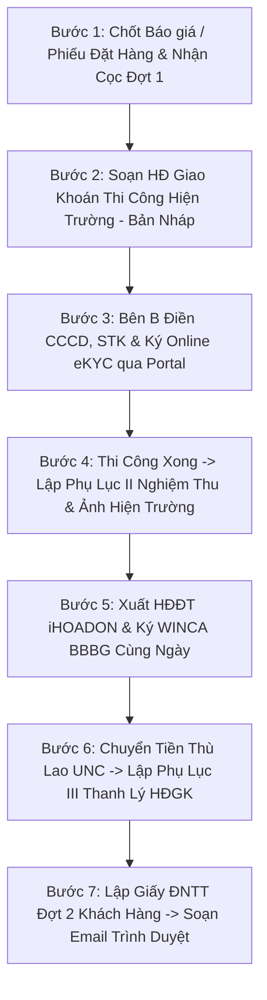

# Learning Proposal: Quy Trình Tổng Thể Vòng Đời Dự Án, Bảng Bất Biến Trình Tự & Cơ Chế Cảnh Báo Vượt Cấp (Project Lifecycle SOP & Anti-Skip Guardrails)

## 1. Classification & Scope
- **Category:** Master Engineering & Operational SOP, Anti-Skip Sequencing Rules, Document Security Policy & Assistant Escalation Protocol.
- **Scope:** 
  1. Toàn bộ quy trình điều hành dự án công nghệ, cung cấp thiết bị phần cứng IoT (Data Logger, Camera, Radar, Kiosk) và khoán việc thi công tại INUT Technology.
  2. Toàn bộ chuỗi phát hành và thẩm định văn bản pháp lý (Hợp đồng, Phụ lục, BBBG, BBNT, Hóa đơn điện tử, Đề nghị thanh toán).
  3. **Quy tắc bắt buộc đối với AI Assistant:** Nắm vững toàn bộ vòng đời dự án; nếu người dùng vô tình làm sai, bỏ bước hoặc thao tác vượt cấp (out-of-sequence), trợ lý **BẮT BUỘC PHẢI LẬP TỨC CẢNH BÁO, NÊU RÕ RỦI RO VÀ ĐƯA RA GIẢI PHÁP ĐÚNG QUY CHUẨN**.

---

## 2. Rationale & Core Problem
1. **Rủi ro hồi tố thuế & vi phạm pháp lý:** Việc xuất hóa đơn trước khi nghiệm thu, ký biên bản bàn giao trước giờ xuất hóa đơn, hay thanh lý hợp đồng khoán trước khi có lệnh chuyển tiền ngân hàng sẽ bị Cơ quan Thuế và Thanh tra chuyên ngành bóc tách, coi là hóa đơn khống hoặc chứng từ phi lý logic.
2. **Rủi ro lộ bí mật kinh doanh & quy mô doanh nghiệp:** Việc đánh số hợp đồng tuần tự (`01`, `02`) giúp đối thủ và đối tác nắm được số lượng giao dịch phát sinh trong năm của công ty.
3. **Rủi ro tranh chấp lao động:** Không tách bạch cá nhân nhận khoán độc lập hoặc nhầm lẫn tên doanh nghiệp đối tác vào hợp đồng khoán việc cá nhân sẽ dẫn đến rủi ro bị quy kết là quan hệ lao động trá hình hoặc tranh chấp hoa hồng.
4. **Rủi ro gửi nhầm / thông tin sai lệch cho khách hàng:** Thao tác tự ý gửi email mà không qua bước duyệt bản nháp (Human-in-the-Loop) có thể gây tổn hại uy tín thương hiệu.

---

## 3. Quy Trình Tổng Thể Vòng Đời Dự Án (7 Bước Chuẩn Mực)

### Bước 1: Tiếp nhận Đơn hàng & Xác nhận Giao dịch (Khách hàng)
* **Văn bản:** Báo giá chính thức hoặc **Phiếu xác nhận đặt hàng / mua hàng** (có giá trị thay thế Hợp đồng kinh tế đối với đơn hàng linh hoạt).
* **Tiến độ thanh toán:** Thường chia 2 đợt (Đợt 1: Cọc ~50%; Đợt 2: Trả chậm linh hoạt lên đến 60–90 ngày).
* **Minh chứng:** Đối soát sao kê ngân hàng Techcombank (`79713`), ghi nhận mã giao dịch nhận cọc (ví dụ: `FT26...`).

### Bước 2: Khởi tạo Hợp đồng Giao khoán việc Cá nhân (Thi công / Lắp đặt)
* **Bản chất pháp lý:** Quan hệ dân sự độc lập giữa INUT (Bên A) và **Cá nhân chuyên môn nhận khoán độc lập (Bên B)**, không gắn tên công ty đối tác vào tư cách Bên B.
* **Quy tắc số hiệu bảo mật:** Bắt buộc dạng `{ddmmyyyy}-01/HĐGK-INUT...` (ví dụ: `20092026-01/HĐGK-INUT-KHANGLINHELV`), tuyệt đối không đánh số thứ tự đơn thuần `01/2026/HĐGK`.
* **Định mức thù lao:** Căn cứ tỷ lệ khoán (ví dụ: 15% giá trị trước VAT). Nếu thù lao $< 5.000.000$ đ thì miễn khấu trừ 10% thuế TNCN theo Khoản 2 Điều 50 Nghị định 253/2026/NĐ-CP.
* **Nguyên tắc "Bảo ký mới ký":** Khởi tạo ở trạng thái **Bản nháp mở (Draft - Unlocked)**, Bên A không ký trước.

### Bước 3: Người nhận khoán điền thông tin & Ký tên Online qua Cổng Portal
* **Liên kết Portal:** Gửi link `/khoan/{token}` cho cộng tác viên.
* **Tính năng thông minh:**
  * Auto-save `localStorage` chống mất dữ liệu khi F5/reload.
  * Tên ngân hàng nhận thù lao để trống tự do (không mặc định Techcombank).
  * Tải / Chụp ảnh CCCD 2 mặt (Mặt trước + Mặt sau).
  * Chụp ảnh chân dung eKYC (chống chối bỏ) và vẽ chữ ký tay cảm ứng (iOS Safari Pointer Events).
  * Cảnh báo màu vàng và hộp thoại `confirm()` xác nhận: Sau khi ký sẽ khóa hợp đồng, muốn sửa phải liên hệ Hotline INUT (`0972.768.491`).
* **Phụ lục I (CCCD):** Tự động sinh trang *Phụ lục I: Ảnh chụp CCCD* gộp chung vào file PDF Hợp đồng (3 trang).

### Bước 4: Thi công hoàn tất & Lập Phụ lục II (Nghiệm thu hiện trường)
* **Văn bản:** *Phụ lục II: Biên bản nghiệm thu hoàn thành công việc & Ảnh hiện trường* (file PDF riêng biệt, tên file chứa mã HĐGK).
* **Mốc thời gian ký bắt buộc:** Ký vào **ngày xuất hóa đơn điện tử** và **TRƯỚC thời điểm xuất hóa đơn** (ví dụ HĐĐT xuất lúc 22:03 ngày 24/09 thì Nghiệm thu ký lúc `16:30:00 ngày 24/09`).
* **Đính kèm:** Tối thiểu 02 ảnh hiện trường thực tế (thiết bị màn hình/datalogger + kiểm thử luồng tín hiệu/camera).

### Bước 5: Phát hành Hóa đơn điện tử & Ký số WINCA Biên bản bàn giao (BBBG)
* **Hóa đơn điện tử (HĐĐT):** Phát hành qua hệ thống iHOADON, lấy mã Cơ quan Thuế cấp hợp lệ.
* **Biên bản bàn giao thiết bị (BBBG):** Lập **CÙNG NGÀY** với HĐĐT, ký số USB Token WINCA phần cứng trên máy `inut-dev` (`192.168.1.10:22`) **SAU giờ xuất HĐĐT từ 45 đến 55 phút**.

### Bước 6: Chi trả thù lao & Lập Phụ lục III (Thanh toán & Thanh lý HĐGK)
* **Thanh toán:** Kế toán tạo lệnh chuyển khoản ngân hàng (Techcombank Business) chi trả thù lao khoán việc.
* **Nội dung chuyển khoản chuẩn:** `INUT tt HDGK {code_part} ky {dd.mm} {HO_TEN_THO}` (ví dụ: `INUT tt HDGK 20092026-01 ky 20.09 TRAN QUOC THANG`).
* **Văn bản:** *Phụ lục III: Biên bản xác nhận thanh toán & Thanh lý HĐ* (file PDF riêng biệt, tên file chứa mã HĐGK).
* **Mốc thời gian ký bắt buộc:** Ký **SAU thời điểm tạo lệnh Ủy nhiệm chi** trên ứng dụng ngân hàng (ví dụ: lệnh tạo lúc 09:22 SA ngày 09/10 thì ký lúc `09:55:52 SA ngày 09/10`).

### Bước 7: Thu hồi công nợ Đợt 2 Khách hàng & Bàn giao Hồ sơ
* **Giấy Đề nghị thanh toán (DNTT):** Vừa vặn đúng **01 trang A4 duy nhất**, nhúng mã VietQR động trực tiếp (Techcombank `79713`, đúng số tiền còn lại, nội dung tiếng Việt không dấu có ngày ký), ký số WINCA.
* **Gửi email bàn giao hồ sơ:** Áp dụng mẫu email chuẩn hóa (Dossier Template), bắt buộc tuân thủ **Human-in-the-Loop** (chỉ soạn nháp trình duyệt, chỉ gửi khi người dùng bấm xác nhận).

---

## 4. Bảng Bất Biến Trình Tự Thời Gian (Sequence Invariants)

| Cặp sự kiện | Quan hệ thời gian bắt buộc | Lý do pháp lý / kế toán thuế |
| :--- | :---: | :--- |
| **HĐ Giao khoán** vs **Nghiệm thu (PL2)** | $T_{\text{HĐGK}} < T_{\text{Nghiệm thu}}$ | Phải có hợp đồng giao việc trước khi thi công và nghiệm thu. |
| **Nghiệm thu (PL2)** vs **Hóa đơn điện tử** | $T_{\text{Nghiệm thu}} \le T_{\text{HĐĐT}}$ *(Cùng ngày, trước giờ HĐ)* | Hàng hóa/dịch vụ phải được nghiệm thu hoàn thành trước khi lập hóa đơn GTGT giao khách. |
| **Hóa đơn điện tử** vs **BBBG thiết bị** | $T_{\text{HĐĐT}} < T_{\text{BBBG}}$ *(Cùng ngày, sau 45–55p)* | Hóa đơn xuất và cấp mã CQT xong mới tiến hành bàn giao thực tế và đóng dấu điện tử. |
| **Lệnh Ủy nhiệm chi** vs **Thanh lý (PL3)** | $T_{\text{Lệnh UNC}} \le T_{\text{Thanh lý}}$ | Tiền phải được thực chuyển thành công trước khi ký xác nhận đã nhận đủ tiền và thanh lý hợp đồng. |
| **Ký Bên B** vs **Ký số WINCA Bên A** | $T_{\text{Ký Bên B}} \le T_{\text{Ký Bên A}}$ | Người nhận khoán điền thông tin và ký xác nhận trước, người dùng duyệt rồi Bên A mới ký số WINCA. |
| **Dấu hình họa** vs **Tem mật mã PAdES `/M`** | $T_{\text{Hình họa}} \equiv T_{\text{PAdES /M}}$ *(Khớp 100% từng giây)* | Chống lỗi lệch pha thời gian con dấu và chữ ký số mật mã khi kiểm tra trên Foxit/Acrobat/NEAC. |

---

## 5. Cơ Chế Cảnh Báo Vượt Cấp & Can Thiệp Của Trợ Lý (Anti-Skip Guardrails)

Khi người dùng ra lệnh trong quá trình chat, Assistant **BẮT BUỘC PHẢI CHỦ ĐỘNG BẬT CẢNH BÁO** trong các trường hợp sau:

1. **Cảnh báo khi yêu cầu ký Bên A trước:**
   * *Hành vi sai:* Yêu cầu ký số WINCA Bên A khi hợp đồng giao khoán còn đang là bản nháp chưa có thông tin Bên B.
   * *Phản ứng trợ lý:* **DỪNG LẠI & CẢNH BÁO:** *"Hợp đồng giao khoán việc cần để ở trạng thái Bản nháp mở để người nhận khoán tự vào link điền thông tin cá nhân, CCCD và ký trước. Khi nào họ hoàn tất và anh duyệt thì em mới kích hoạt ký số Bên A."*
2. **Cảnh báo khi mốc thời gian nghiệm thu sau giờ hóa đơn:**
   * *Hành vi sai:* Đặt ngày/giờ nghiệm thu sau thời điểm xuất hóa đơn điện tử.
   * *Phản ứng trợ lý:* **DỪNG LẠI & CẢNH BÁO:** *"Nghiệm thu công việc phải diễn ra TRƯỚC thời điểm phát hành hóa đơn điện tử (ví dụ: HĐ xuất lúc 22:03 thì nghiệm thu phải ký trước lúc 16:30 cùng ngày) để bảo vệ tính hợp lệ khi giải trình thuế."*
3. **Cảnh báo khi thanh lý hợp đồng trước khi có ủy nhiệm chi:**
   * *Hành vi sai:* Ký Phụ lục III (Thanh lý & thanh toán) khi chưa có lệnh chuyển tiền ngân hàng.
   * *Phản ứng trợ lý:* **DỪNG LẠI & CẢNH BÁO:** *"Phụ lục III xác nhận thanh lý chỉ được ký SAU thời điểm tạo lệnh chuyển khoản ngân hàng (UNC) để đảm bảo tính xác thực dòng tiền."*
4. **Cảnh báo khi dùng số hợp đồng tuần tự đơn thuần (`01`, `02`):**
   * *Hành vi sai:* Yêu cầu đặt mã hợp đồng là `01/2026/HĐGK`.
   * *Phản ứng trợ lý:* **CHỦ ĐỘNG CHUẨN HÓA & CẢNH BÁO:** *"Theo quy tắc bảo mật số lượng hợp đồng, mã hợp đồng được chuẩn hóa tự động ghép ngày tháng: `20092026-01/HĐGK-INUT...` để bên ngoài không suy đoán được quy mô phát sinh của công ty."*
5. **Cảnh báo khi yêu cầu gửi email ngay lập tức:**
   * *Hành vi sai:* Yêu cầu gửi email thẳng cho khách hàng mà chưa trình duyệt.
   * *Phản ứng trợ lý:* **TUÂN THỦ HUMAN-IN-THE-LOOP:** Chỉ hiển thị bản nháp đầy đủ (Người nhận, CC, tiêu đề, nội dung, 4 file đính kèm) và hỏi: *"Anh xem qua bản nháp đã chuẩn chưa, khi nào anh chốt 'Gửi đi' thì em mới kích hoạt gửi email."*
6. **Cảnh báo khi văn bản đối ngoại chứa tên mã nội bộ:**
   * *Hành vi sai:* Sử dụng cụm từ `"trên hệ thống KSP"`.
   * *Phản ứng trợ lý:* Tự động sửa dứt điểm thành `"trên nền tảng lưu trữ hợp đồng của Bên A"`.

---

## 6. Thẩm Định Chữ Ký Số Chính Hãng Quốc Gia (NEAC Protocol)
* **Ký số chính thức:** Bắt buộc dùng USB Token WINCA phần cứng trên máy trạm Windows `inut-dev` (`192.168.1.10:22`, Cert ID: `6616B8A61F228D0EAFF8AAF5F44F3ECD660DD8CD`, Issuer: `WINGROUP`).
* **Tích hợp kiểm tra 1-click:** Cổng Mobile Portal tích hợp nút kiểm tra trực tuyến kết nối thẳng API Cổng Quốc gia NEAC (`https://neac.gov.vn/vi/Home/VerifyFileByNeac`) để khách hàng/cộng tác viên xem trực tiếp kết quả thẩm định:
  * Trạng thái toàn vẹn: *Không bị thay đổi (100%)*
  * Giá trị pháp lý: *Hợp lệ tại thời điểm ký*
  * Thu hồi chứng thư: *OCSP / CRL Đạt chuẩn*
* **Dòng hướng dẫn công khai:** Luôn ghi rõ đường link chính thức của Trung tâm Chứng thực điện tử quốc gia (Bộ TTTT) tại `https://neac.gov.vn/vi` để khách hàng tự tải file PDF về kiểm tra độc lập.

---

## 7. Quy Chuẩn Báo Giá Giải Pháp Billiards (iNut BilliardLive - Camera & Check VAR)

### 7.1. Nguyên tắc Ký số: "Báo Giá Bida Không Cần Ký Số"
* **Tuyệt đối KHÔNG ký số điện tử (PAdES / WINCA) vào Báo giá Billiards:**
  * Báo giá giải pháp quán bida là tài liệu chào giá thương mại nhanh gửi cho chủ câu lạc bộ (CLB) qua Zalo, Messenger hoặc in trực tiếp.
  * Không ký số mật mã PAdES/CAdES, không cần cắm USB Token.
* **Cơ chế sau khi quản lý cấu hình xong:**
  * Hệ thống tự động sinh (generate) tệp **PDF sạch hoàn chỉnh**, định dạng chuẩn A4, hiển thị chữ ký/dấu xác nhận nội bộ của Trưởng bộ phận kinh doanh (`Đại diện trưởng bộ phận (Đã ký)`).
  * Trả ra link PDF trực tiếp ngay khi bấm Generate để người dùng copy link gửi Zalo hoặc tải về gửi ngay cho khách hàng.

### 7.2. Cấu trúc bóc tách khối lượng 02 Gói riêng biệt
* **Gói I: Lắp đặt camera & hạ tầng thi công (Phần cứng & thi công hiện trường):**
  1. Camera KBVision A5W (5MPixel Full Color đêm, mic/loa 2 chiều, góc rộng): Tính theo số bàn bida ($N \times 550.000$ đ).
  2. POE Splitter 5V DC (chuyển POE LAN thành LAN + Nguồn): $N \times 65.000$ đ.
  3. Switch PoE Gigabit (GPOE408 AI Watchdog): Tính theo số port ($\le 8$ bàn dùng Switch 8P 1.100.000 đ; từ 9 bàn trở lên dùng Switch 16P hoặc 2 Switch 8P).
  4. Cáp mạng LAN Cat5e/Cat6: Dự toán theo thực tế $\sim 30 - 35$m/bàn $\times 10.000$ đ/m (ví dụ 9 bàn $\approx 300$m = 3.000.000 đ).
  5. Vật tư phụ (hạt mạng, tắc kê, ốc vít, băng keo, ống ruột gà): 500.000 đ/gói.
  6. Nhân công lắp đặt & căn chỉnh góc từng bàn: $N \times 300.000$ đ/bàn.
  * $\rightarrow$ **Tổng cộng Gói I**: Có dòng tổng tiền riêng biệt.
* **Gói II: Công nghệ Check VAR, cắt clip & Livestream (Thiết bị số hóa & Phần mềm):**
  1. Thiết bị Stream Model C1 (Hộp xử lý, lưu trữ và số hóa 8-16 kênh camera, QR cắt clip, livestream Full HD 30fps lên Facebook/YouTube/OBS, bảng tỷ số): Đơn giá chuẩn 14.790.000 đ (hỗ trợ chiết khấu thương mại % ví dụ $5\% = -739.500$ đ $\rightarrow$ còn 14.050.500 đ).
  2. Gói giảm giá Marketing / Khuyến mãi kích cầu mở quán: Trừ trực tiếp (ví dụ -885.500 đ).
  * $\rightarrow$ **Tổng cộng Gói II**: Có dòng tổng tiền riêng biệt.
* **Tổng cộng Dự án (I + II):** Bằng tổng Gói I + Gói II (ví dụ 26.000.000 đ).

### 7.3. Quy định Thuế VAT & Lộ trình thanh toán trả góp
* **Chính sách Thuế:** Báo giá niêm yết **CHƯA BAO GỒM VAT**. Bắt buộc ghi chú rõ ràng mức thuế 8%:  
  `* Báo giá chưa bao gồm VAT 8% (Nếu quý khách hàng có nhu cầu xuất hóa đơn VAT 8% vui lòng liên hệ để được hỗ trợ)`
* **Chính sách Bảo hành:**
  * Thiết bị được bảo hành 1 năm 1 đổi 1; từ năm thứ 2 phí bảo hành 300.000 VNĐ/lần.
  * Bộ nhớ / thẻ nhớ bảo hành 3 năm.
* **Quy trình thanh toán linh hoạt (Trả góp 3–6 đợt):**
  * Hỗ trợ trả 1 lần hoặc chia theo đợt (Đợt 1: Cọc/Bắt đầu thi công; Các đợt tiếp theo giãn cách hàng tháng, hỗ trợ trả góp không lãi suất).

---

## 8. Quy Chuẩn Ký Số Điện Tử & Định Dạng Con Dấu (Digital Signature Policy)
* **Nguyên tắc "Đơn nguồn con dấu" (Single Source of Truth for Stamp):**
  * Khi văn bản được ký số PAdES bằng USB Token WINCA / PyHanko, **mã HTML template tuyệt đối không vẽ khung con dấu tĩnh `.digital-stamp` trong HTML**.
  * Khung ký tên chỉ để khoảng trống `.space` tự nhiên để duy nhất module ký số (`appearance.render_signature`) đóng dấu vào.
  * Tránh hoàn toàn lỗi xuất hiện 2 con dấu của cùng một Bên A đè lên nhau hoặc lệch dòng.
* **Quy chuẩn thời gian ký số giây và phút lẻ tự nhiên:**
  * Không đặt mốc giây tròn `:00` hay phút tròn chục `:30` nhân tạo.
  * Tự động tạo mốc giây và phút lẻ ngẫu nhiên thực tế (ví dụ: `10:37:43`, `16:38:45`, `09:56:43`).
  * Thời gian hiển thị trên con dấu hình họa và thời gian mã hóa mật mã PAdES `/M` phải khớp nhau 100% từng giây.
* **Thuật toán ngắt dòng cân đối (`wrap_balanced`):**
  * Tự động cân đối từ ngữ, ưu tiên chọn cỡ chữ phù hợp để dòng `Ký bởi: CÔNG TY CỔ PHẦN ĐẦU TƯ VÀ PHÁT TRIỂN CÔNG NGHỆ INUT` hiển thị trọn vẹn trên 1 dòng, không để rớt từ đơn côi (`INUT`) xuống dòng riêng.
* **Quy chuẩn Hợp đồng khoán việc dịch vụ / Marketing:**
  * Khoán việc thuần túy dân sự theo sản phẩm đầu ra hoàn thành (deliverables-based), không quản lý giờ giấc/chấm công.
  * Thù lao dưới 5.000.000 VNĐ/lần được miễn khấu trừ 10% thuế TNCN tại nguồn theo Khoản 2 Điều 50 Nghị định 253/2026/NĐ-CP.
  * Cho phép người nhận khoán tải ảnh hiện trường/sản phẩm từ cả Camera và Thư viện ảnh (Gallery).

---

## 9. Quy Chuẩn Tự Động Tăng Version & Auto-Commit (Version Bump & Delivery Policy)
* **Quy tắc tăng phiên bản tự động (Auto-increment Version):**
  - Khi hoàn thành một tính năng mới, cải tiến nghiệp vụ hoặc cập nhật module hệ thống trong `ksp-pdfsign`, trợ lý **tự động tăng số phiên bản** trong `frontend/package.json` và `frontend/package-lock.json` (ví dụ: `1.0.0` $\rightarrow$ `1.1.0` $\rightarrow$ `1.2.0`).
  - Giúp đồng bộ phiên bản giao diện người dùng, cache busting và theo dõi tiến độ phát triển rõ ràng.
* **Quy tắc Auto-Commit định kỳ:**
  - Không để tồn đọng mã nguồn sửa đổi dở dang khi kết thúc mỗi lượt trao đổi hoặc khi hoàn thành từng mốc tính năng.
  - Sử dụng thông điệp commit chuẩn hóa Conventional Commits (`feat(...)`, `fix(...)`, `docs(...)`) mô tả chính xác nội dung thay đổi.
  - Tự động `git push origin main` sau khi toàn bộ test suite (`pytest`) và build (`npm run build`) đã kiểm tra đạt 100%.
